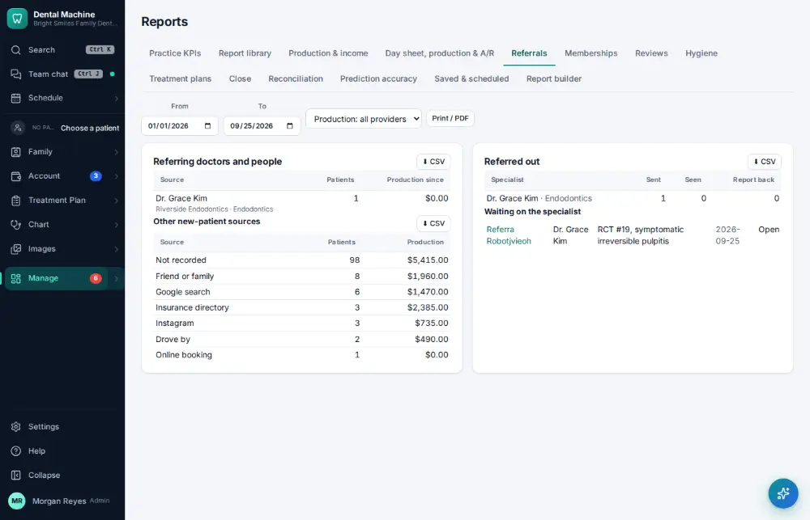

# How do I check where new patients come from?

**Who:** office manager · **Where:** Manage ▾ → Reports → Referrals · **How often:** About monthly

Where new patients come from: referring doctors, patients and other sources.

## Steps

1. Press Ctrl/⌘K, type "referrals report", Enter: where new patients come from  
   Keys: <kbd>Ctrl/⌘ K</kbd> type “referrals report” <kbd>Enter</kbd>

   

## Related

- [How do I record who referred a new patient?](A092-record-who-referred-a-new-patient.md)
- [How do I look at marketing results?](A149-look-at-marketing-results.md)
- [How do I close the month?](A146-close-the-month.md)
- [How do I reconcile the bank and books?](A148-reconcile-the-bank-and-books.md)
- [How do I check the hygiene report?](A150-check-the-hygiene-report.md)

---
[All how-tos](README.md) · Action A152 · screenshots from the robot run of 2026-09-25
