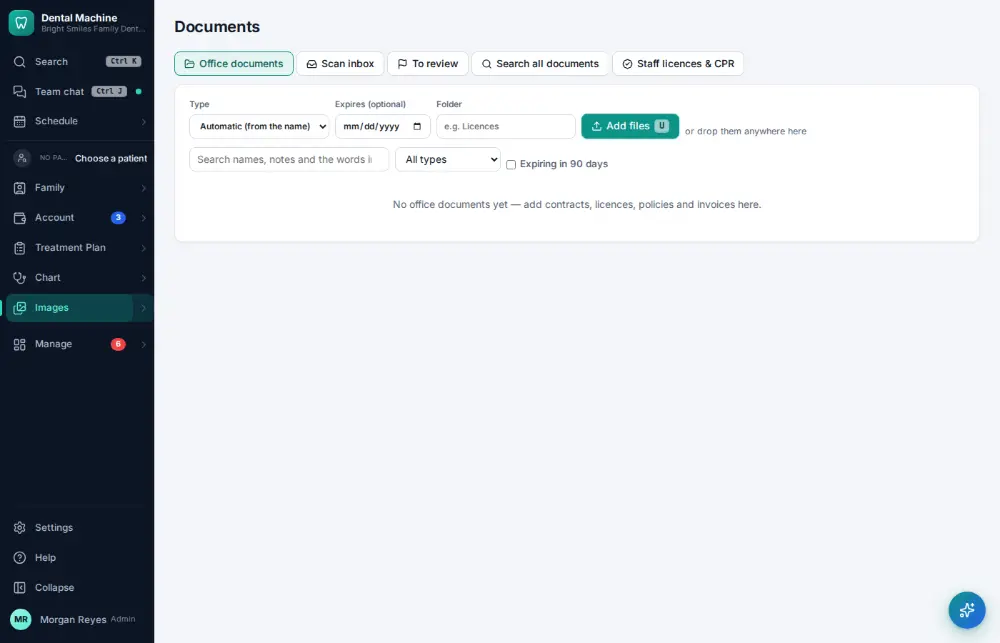
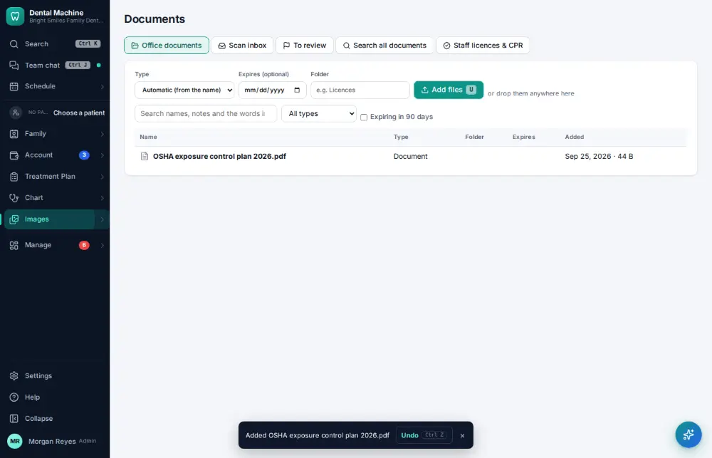

# How do I file an office document?

**Who:** office manager · **Where:** Images ▾ → Office documents · **How often:** About monthly

Office documents keeps the practice’s own papers — contracts, licences, OSHA and HIPAA policies. Its type is worked out from the file name.

## Where to start

## Steps

1. Office documents: press U and choose the file (its type is worked out from the name)  
   Keys: <kbd>U</kbd>

   

## With the mouse

Click “Add files” and choose the file.

## Related

- [How do I track staff licenses, CPR and CE due dates?](A170-track-staff-licenses-cpr-and-ce-due-dates.md)
- [How do I upload a scanned paper document?](A069-upload-a-scanned-paper-document.md)
- [How do I check that backups ran?](A159-check-that-backups-ran.md)
- [How do I look up who changed something?](A160-look-up-who-changed-something.md)
- [How do I give a patient a copy of their record?](A141-give-a-patient-a-copy-of-their-record.md)

---
[All how-tos](README.md) · Action A153 · screenshots from the robot run of 2026-09-25
