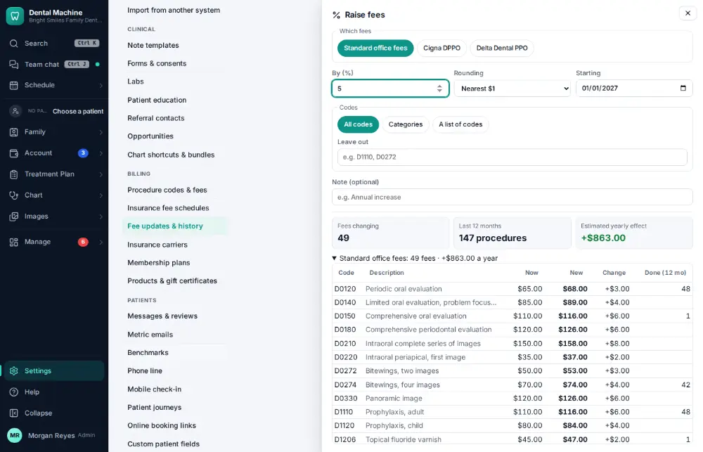
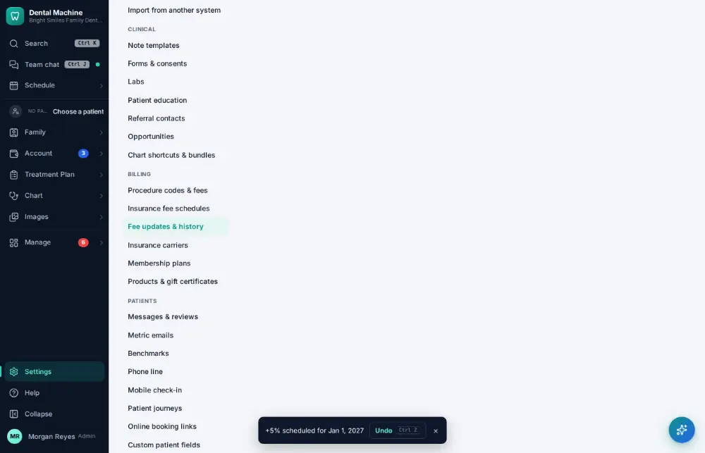

# How do I update the office fee schedule?

**Who:** office manager · **Where:** Settings → Fee updates & history · **How often:** About monthly

Raise the office’s fees by a percentage from a date. 5% from next January 1 are the defaults, with a preview of what it does to a year’s production.

## Steps

1. Click Settings (bottom of the menu), then "Fee updates & history"

   

2. Press R: raise fees — 5% from next January 1 are the defaults, with a preview of the yearly effect  
   Keys: <kbd>R</kbd>

   

3. Click "Schedule for Jan 1"

   

## Tips

- The old fees are kept as the version before, so history stays correct.
- Fee changes need the stronger permission and are audited.

## Related

- [How do I update an insurance fee schedule?](A155-update-an-insurance-fee-schedule.md)
- [How do I add a procedure code?](A165-add-a-procedure-code.md)
- [How do I add a staff member's login?](A156-add-a-staff-member-s-login.md)
- [How do I change a staff member's permissions?](A157-change-a-staff-member-s-permissions.md)
- [How do I edit a note template?](A161-edit-a-note-template.md)

---
[All how-tos](README.md) · Action A154 · screenshots from the robot run of 2026-09-25
