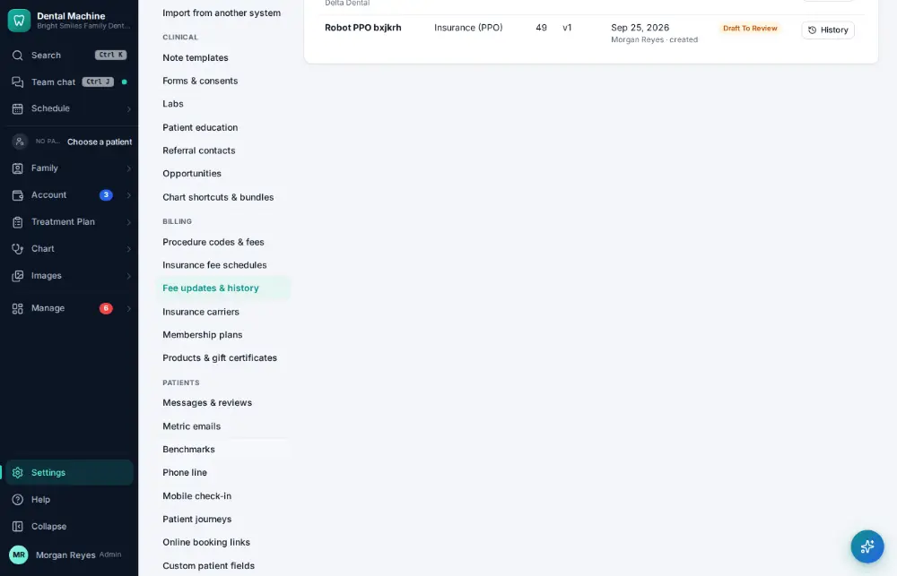
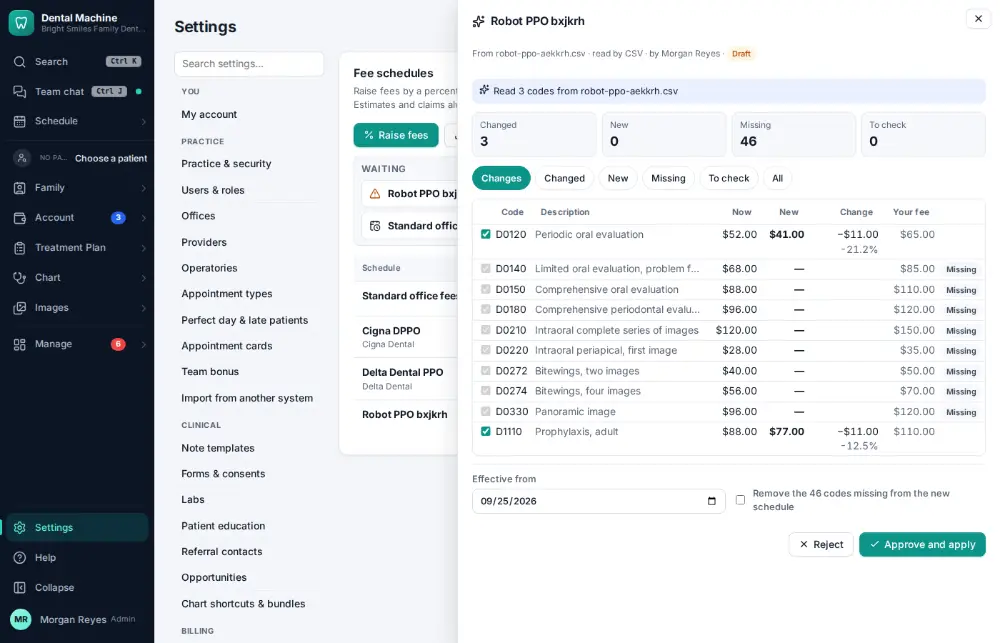
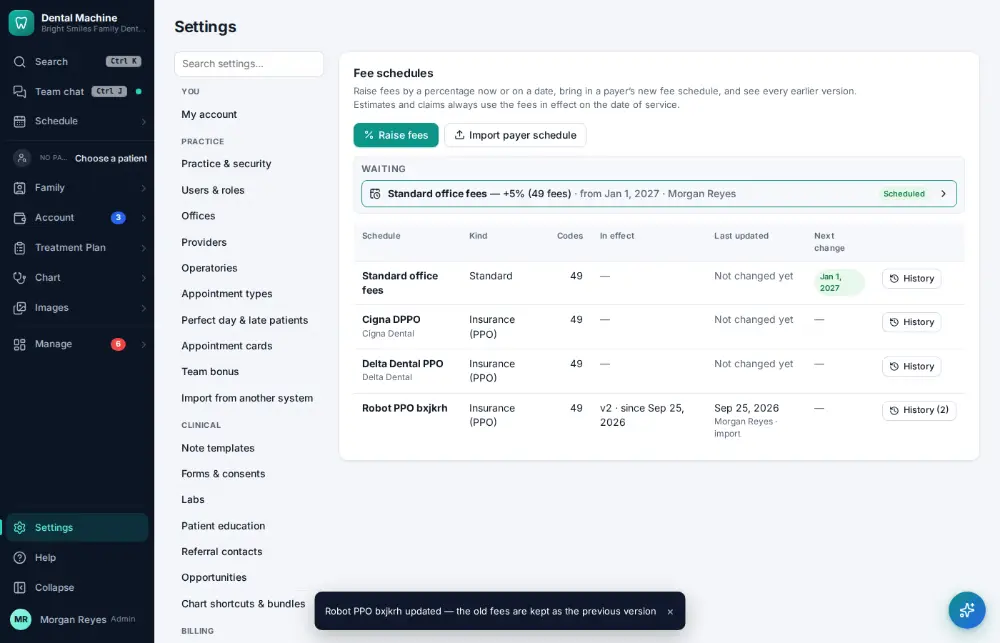

# How do I update an insurance fee schedule?

**Who:** billing · **Where:** Settings → Fee updates & history · **How often:** About monthly

When a payer sends a new fee schedule it waits in Fee updates & history for approval, with every difference side by side. Approving applies it; the old fees are kept.

## Steps

1. Click Settings (bottom of the menu), then "Fee updates & history"

   

2. Click the new schedule waiting for approval (the payer’s file): every difference is shown side by side

   

3. Press Enter (Approve has the focus): the new fees apply; the old ones are kept as the version before  
   Keys: <kbd>Enter</kbd>

   

## Related

- [How do I update the office fee schedule?](A154-update-the-office-fee-schedule.md)
- [How do I add an insurance carrier?](A139-add-an-insurance-carrier.md)
- [How do I add a staff member's login?](A156-add-a-staff-member-s-login.md)
- [How do I change a staff member's permissions?](A157-change-a-staff-member-s-permissions.md)
- [How do I edit a note template?](A161-edit-a-note-template.md)

---
[All how-tos](README.md) · Action A155 · screenshots from the robot run of 2026-09-25
