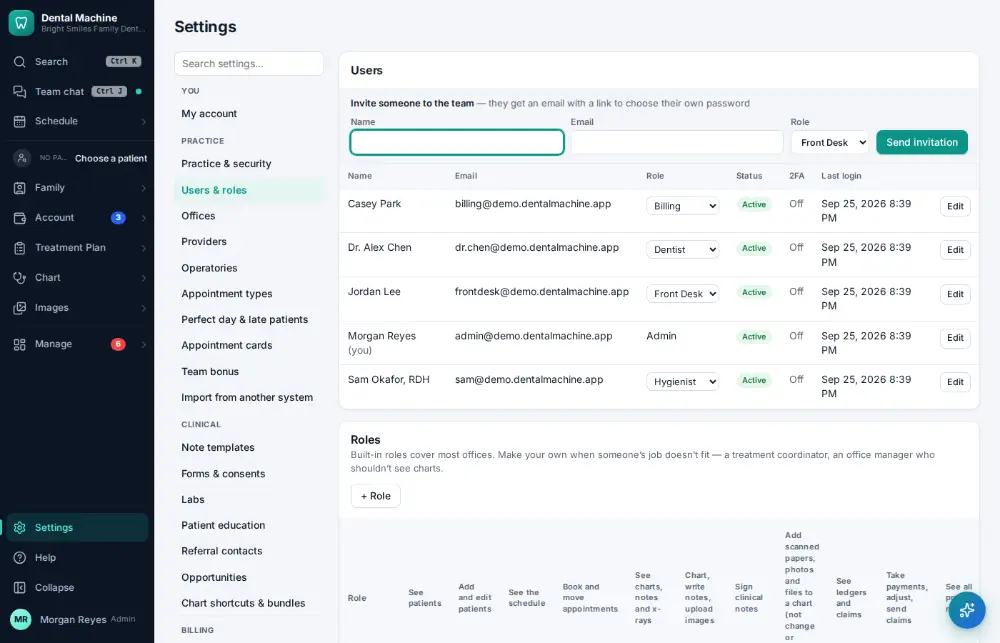
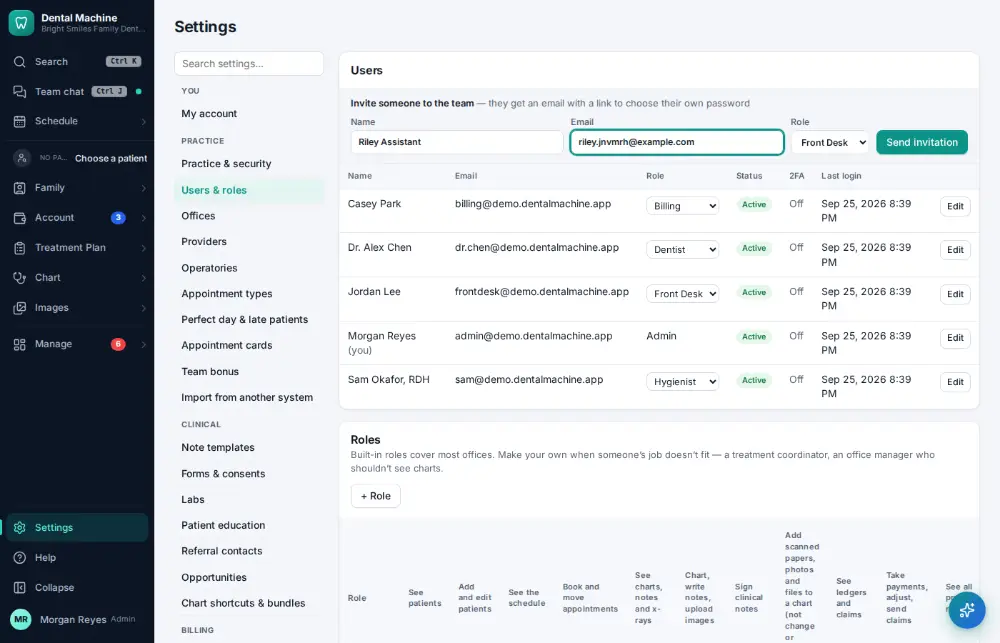
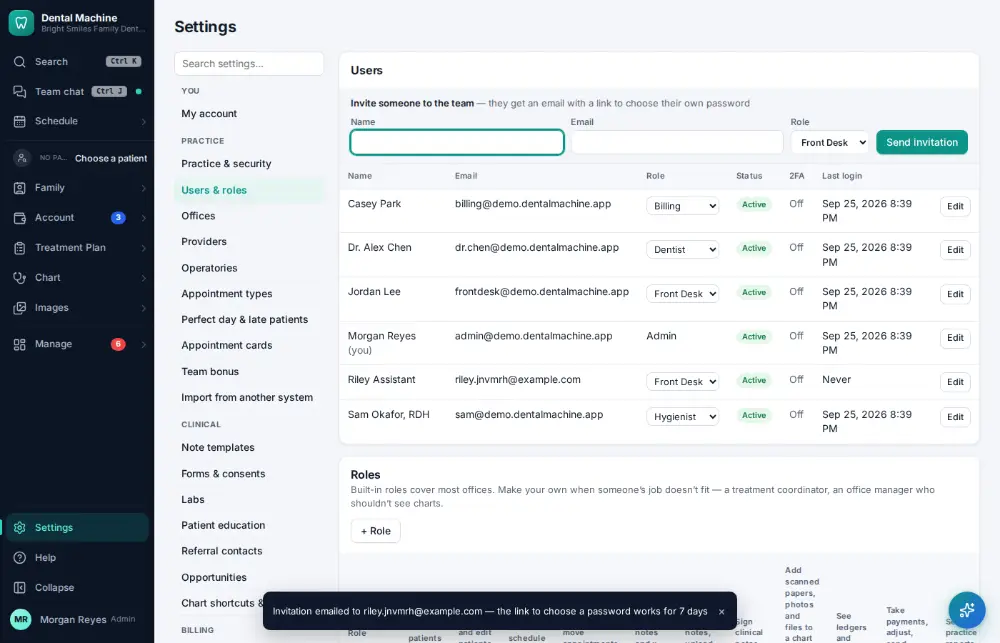

# How do I add a staff member's login?

**Who:** office manager · **Where:** Settings → Users & roles · **How often:** About monthly

Invite a new team member: type their name and email and press Enter. They get an email with a link to choose their own password, and start as front desk.

## Steps

1. Click Settings (bottom of the menu), then "Users & roles"

   

2. Type their name (the cursor is already in "Invite someone"), Tab, their email (they start as front desk)  
   Keys: <kbd>Tab</kbd>

   

3. Press Enter (Send invitation): they get an email with a link to choose their own password  
   Keys: <kbd>Enter</kbd>

   

## Tips

- Change their role afterwards if needed ([A157](A157-change-a-staff-member-s-permissions.md)).

## Related

- [How do I change a staff member's permissions?](A157-change-a-staff-member-s-permissions.md)
- [How do I change my password?](A174-change-my-password.md)
- [How do I update the office fee schedule?](A154-update-the-office-fee-schedule.md)
- [How do I update an insurance fee schedule?](A155-update-an-insurance-fee-schedule.md)
- [How do I edit a note template?](A161-edit-a-note-template.md)

---
[All how-tos](README.md) · Action A156 · screenshots from the robot run of 2026-09-25
