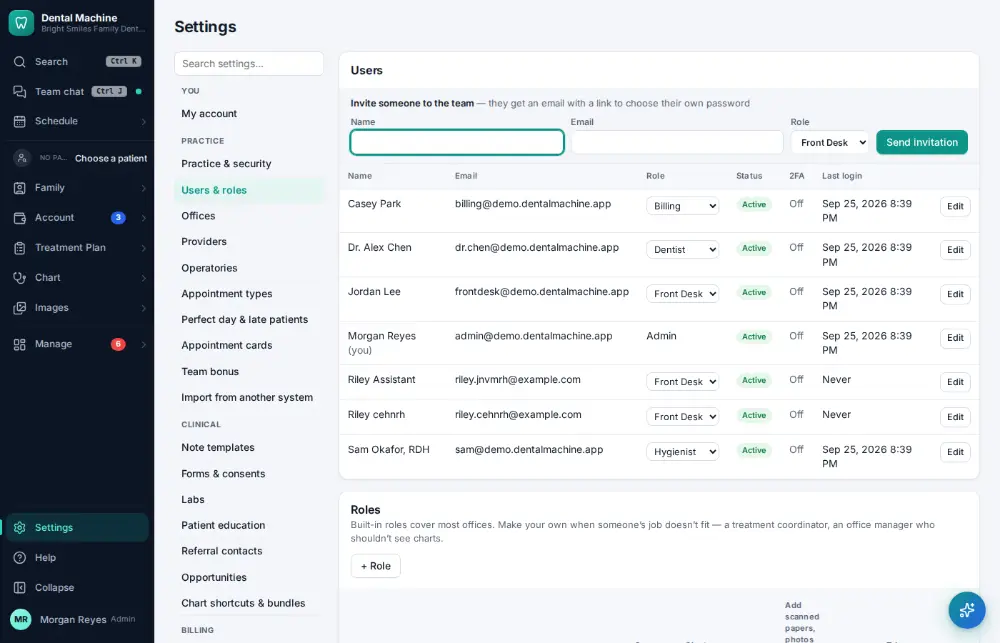
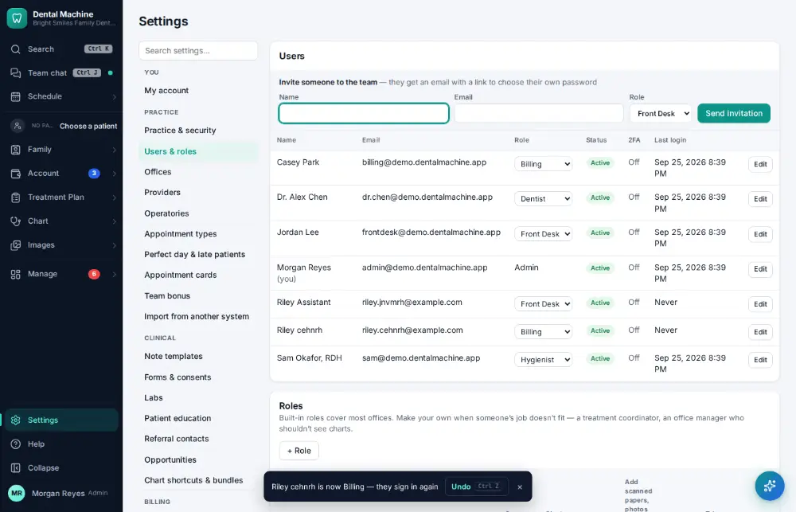

# How do I change a staff member's permissions?

**Who:** office manager · **Where:** Settings → Users & roles · **How often:** About monthly

Pick a new role for someone; it saves at once, is audited, and they are signed out to sign in with the new role.

## Steps

1. Click Settings (bottom of the menu), then "Users & roles"

   

2. Pick the new role (here Billing) in the person’s Role list: saved at once (audited; they sign in again; Undo shows)

   

## Tips

- Undo on the notice puts the old role back.

## Related

- [How do I add a staff member's login?](A156-add-a-staff-member-s-login.md)
- [How do I look up who changed something?](A160-look-up-who-changed-something.md)
- [How do I update the office fee schedule?](A154-update-the-office-fee-schedule.md)
- [How do I update an insurance fee schedule?](A155-update-an-insurance-fee-schedule.md)
- [How do I edit a note template?](A161-edit-a-note-template.md)

---
[All how-tos](README.md) · Action A157 · screenshots from the robot run of 2026-09-25
