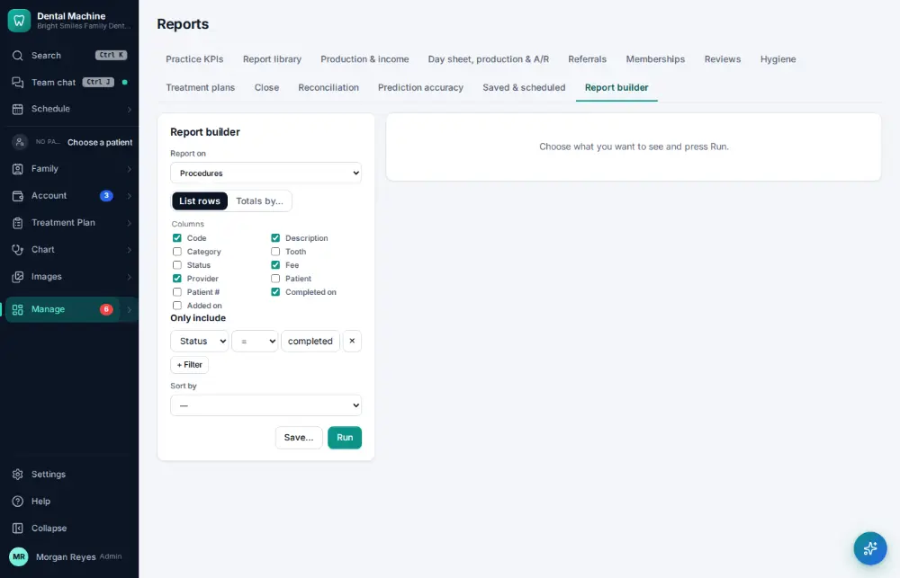
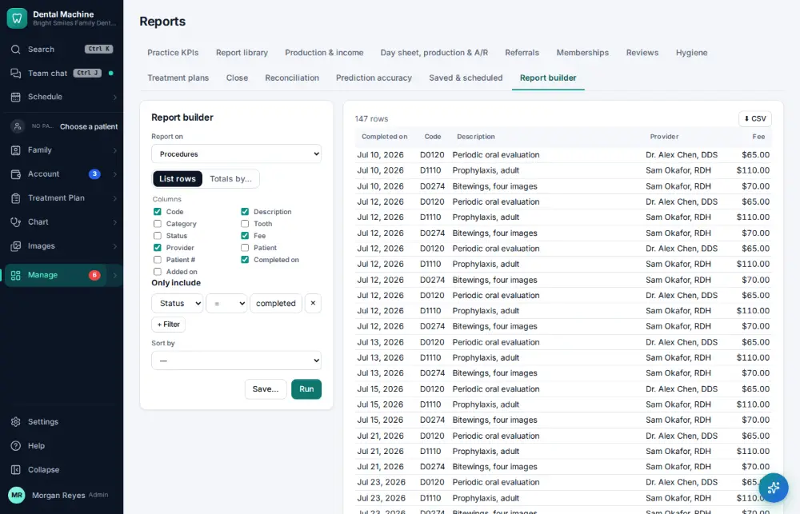
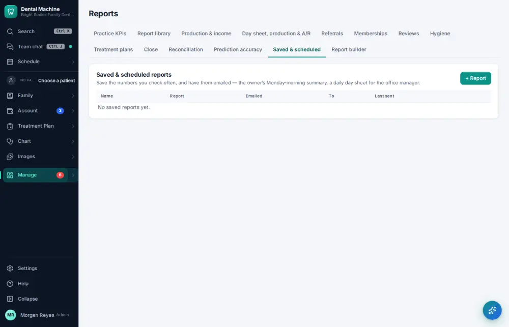

# How do I build or schedule a custom report?

**Who:** office manager · **Where:** Manage ▾ → Reports → Report builder / Saved & scheduled · **How often:** About monthly

The report builder makes your own report: pick what to report on, run it, then save it (and have it emailed on a schedule).

## Where to start

## Steps

1. Report builder: pick what to report on (procedures, completed are the defaults) and click Run

   

2. Click Save: a browser box asks for the report’s name

   

## Related

- [How do I export a report to a spreadsheet?](A142-export-a-report-to-a-spreadsheet.md)
- [How do I ask a question about your numbers?](A140-ask-a-question-about-your-numbers.md)
- [How do I close the month?](A146-close-the-month.md)
- [How do I reconcile the bank and books?](A148-reconcile-the-bank-and-books.md)
- [How do I look at marketing results?](A149-look-at-marketing-results.md)

---
[All how-tos](README.md) · Action A158 · screenshots from the robot run of 2026-09-25
