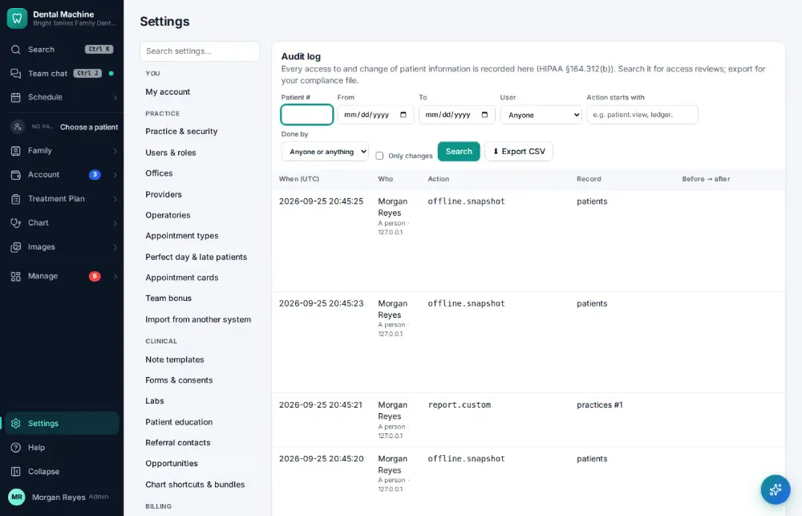
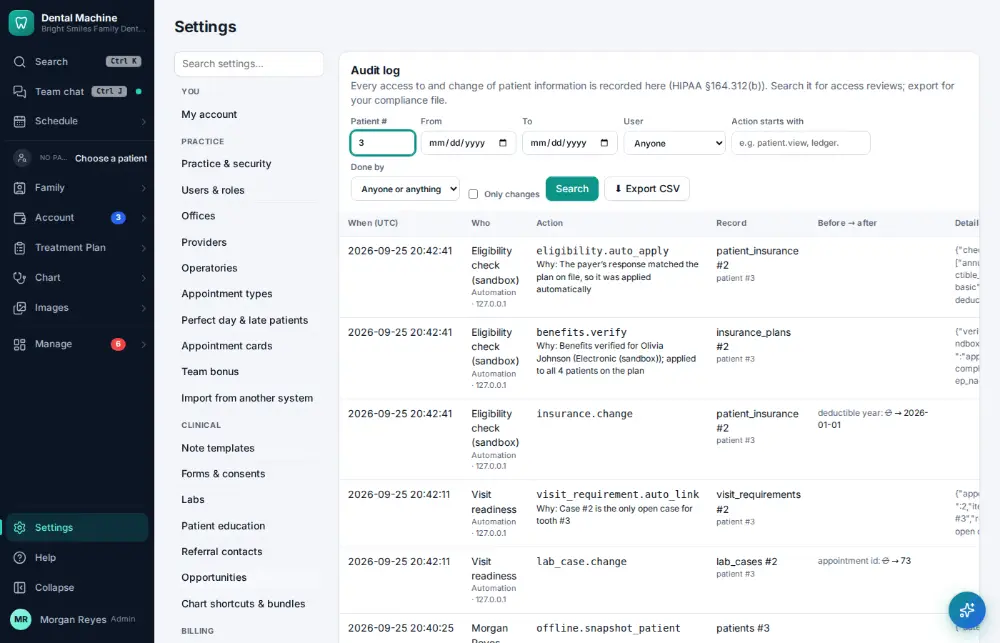

# How do I look up who changed something?

**Who:** office manager · **Where:** Settings → Audit log · **How often:** About monthly

The audit log shows who changed what, when, and what it was before. Type a patient’s chart number to see every change to their chart.

## Steps

1. Click Settings (bottom of the menu), then "Audit log"

   

2. Type the patient # (the cursor is already there): every change to their chart shows as you type

   

## Tips

- The audit log can’t be edited by anyone.

## Related

- [How do I check that backups ran?](A159-check-that-backups-ran.md)
- [How do I change a staff member's permissions?](A157-change-a-staff-member-s-permissions.md)
- [How do I record a patient complaint or incident?](A168-record-a-patient-complaint-or-incident.md)
- [How do I log an exposure or sharps injury?](A169-log-an-exposure-or-sharps-injury.md)
- [How do I file an office document?](A153-file-an-office-document.md)

---
[All how-tos](README.md) · Action A160 · screenshots from the robot run of 2026-09-25
