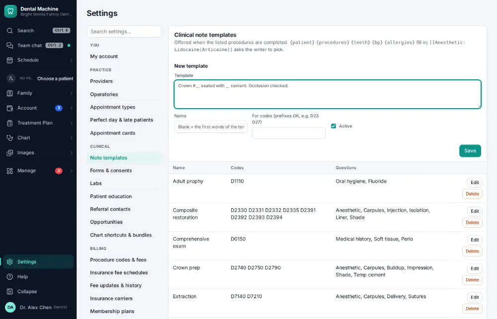
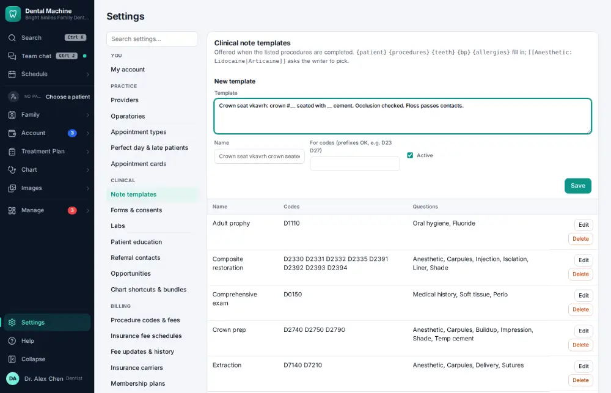
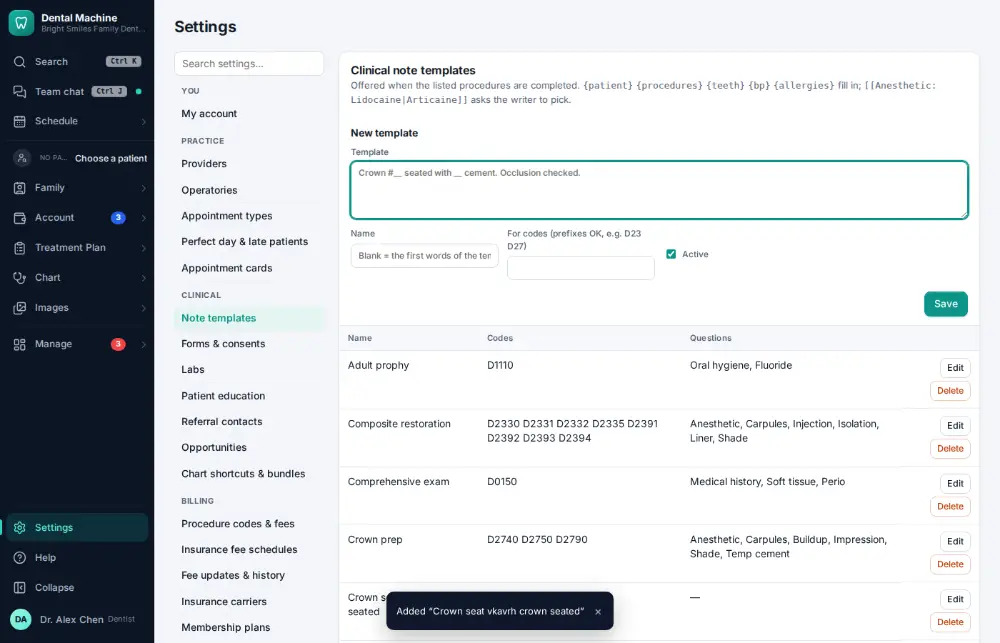

# How do I edit a note template?

**Who:** dentist · **Where:** Settings → Note templates · **How often:** About monthly

Write the template the way you want notes to start; its name comes from its first words unless you type one.

## Steps

1. Click Settings (bottom of the menu), then "Note templates"

   

2. Type the template (the cursor is already in it; the name comes from its first words unless you type one)

   

3. Press Ctrl/⌘+Enter: saved (it’s in the list)  
   Keys: <kbd>Ctrl/⌘ Enter</kbd>

   

## Related

- [How do I write a clinical note?](A011-write-a-clinical-note.md)
- [How do I dictate a note by voice?](A052-dictate-a-note-by-voice.md)
- [How do I update the office fee schedule?](A154-update-the-office-fee-schedule.md)
- [How do I update an insurance fee schedule?](A155-update-an-insurance-fee-schedule.md)
- [How do I add a staff member's login?](A156-add-a-staff-member-s-login.md)

---
[All how-tos](README.md) · Action A161 · screenshots from the robot run of 2026-09-25
