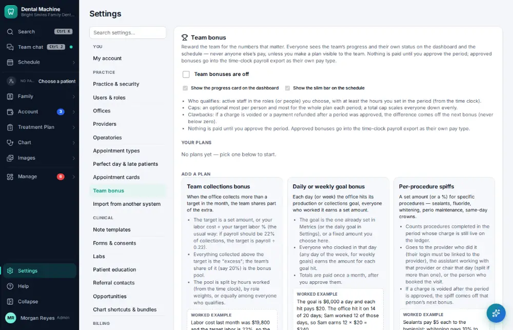
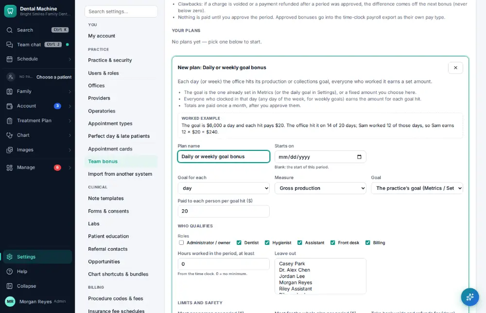
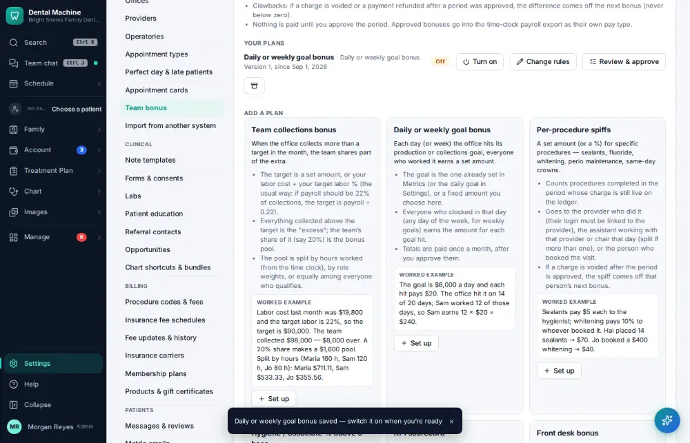
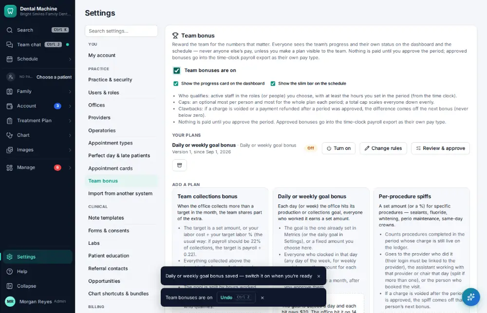

# How do I set up the team bonus?

**Who:** office manager · **Where:** Settings → Team bonus · **How often:** About monthly

Set up a team bonus (for example a daily or weekly goal); the plan opens filled in. Then switch team bonuses on so the team sees its progress.

## Steps

1. Click Settings (bottom of the menu), then "Team bonus"

   

2. Click "Set up" on "Daily or weekly goal bonus": the plan opens filled in (name, goal, amount)

   

3. Press Ctrl/⌘+Enter: the plan is saved  
   Keys: <kbd>Ctrl/⌘ Enter</kbd>

   

4. Tick "Team bonuses are off" → on: the team sees its progress

   

## Related

- [How do I check my bonus?](A131-check-my-bonus.md)
- [How do I track staff licenses, CPR and CE due dates?](A170-track-staff-licenses-cpr-and-ce-due-dates.md)
- [How do I export payroll?](A138-export-payroll.md)
- [How do I request time off?](A133-request-time-off.md)
- [How do I approve a time-off request?](A134-approve-a-time-off-request.md)

---
[All how-tos](README.md) · Action A162 · screenshots from the robot run of 2026-09-25
