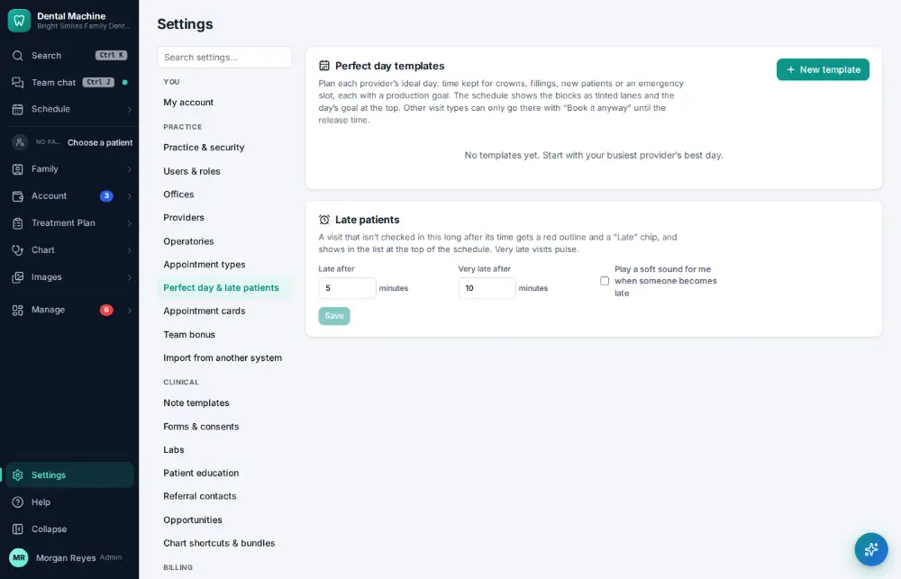
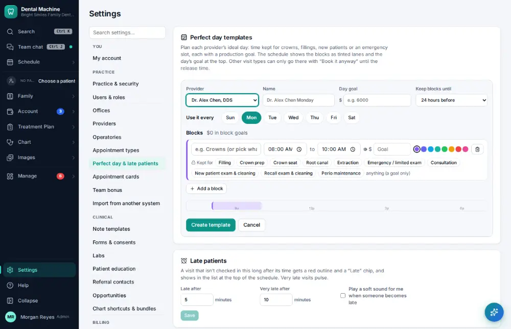
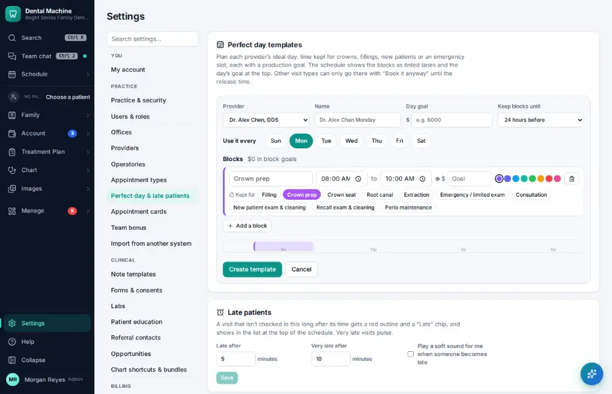
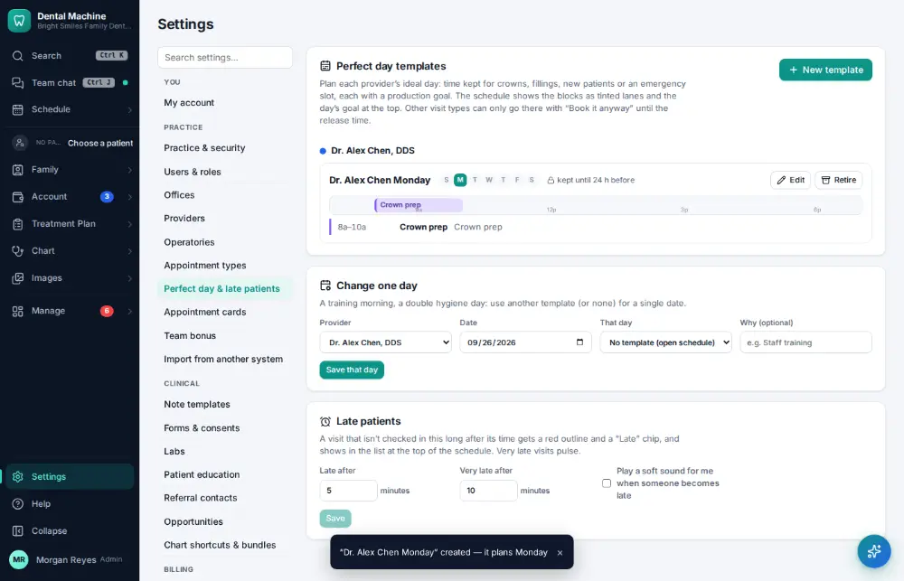

# How do I set up a perfect-day schedule template?

**Who:** office manager · **Where:** Settings → Perfect day & late patients · **How often:** About monthly

A perfect-day template keeps time on the schedule for the work you want (for example crown preps on Monday mornings). The block shows as a lane on the schedule.

## Steps

1. Click Settings (bottom of the menu), then "Perfect day & late patients"

   

2. Click "New template": the first provider, Monday, and one block 8–10 AM are ready

   

3. Click "Crown prep" under the block: it’s kept for crowns (and named for them)

   

4. Click "Create template": the block shows as a lane on Mondays

   

## Related

- [How do I block time on the schedule?](A115-block-time-on-the-schedule.md)
- [How do I review schedule capacity?](A129-review-schedule-capacity.md)
- [How do I give a provider a day off or change their hours?](A120-give-a-provider-a-day-off-or-change-their-hours.md)
- [How do I book a same-day emergency visit?](A082-book-a-same-day-emergency-visit.md)
- [How do I fill an opening from the ASAP list?](A070-fill-an-opening-from-the-asap-list.md)

---
[All how-tos](README.md) · Action A163 · screenshots from the robot run of 2026-09-25
