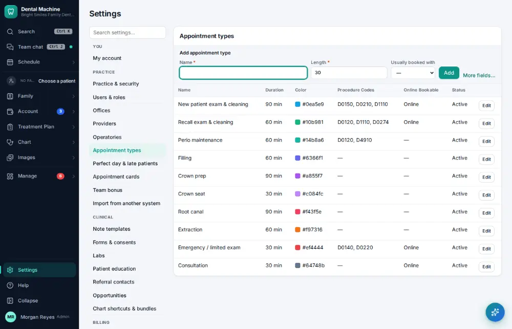
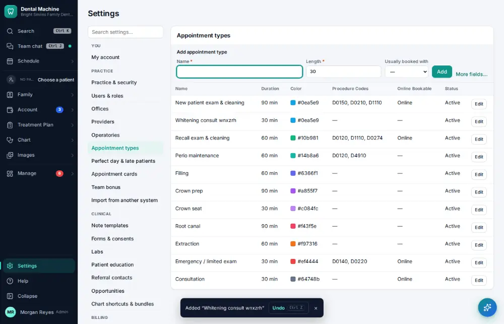

# How do I add an appointment type?

**Who:** office manager · **Where:** Settings → Appointment types · **How often:** A few times a year

Add a kind of visit with its usual length.

## Steps

1. Click Settings (bottom of the menu), then "Appointment types"

   

2. Type the new appointment type: Name, Length (the cursor is already in the add line)

   

3. Press Enter: added (Undo on the toast)  
   Keys: <kbd>Enter</kbd>

   

## Tips

- Undo on the notice removes it again.

## Related

- [How do I add a procedure code?](A165-add-a-procedure-code.md)
- [How do I change an appointment's type, length or note?](A041-change-an-appointment-s-type-length-or-note.md)
- [How do I edit a form or consent?](A166-edit-a-form-or-consent.md)
- [How do I change reminder and message settings?](A167-change-reminder-and-message-settings.md)
- [How do I update the office fee schedule?](A154-update-the-office-fee-schedule.md)

---
[All how-tos](README.md) · Action A164 · screenshots from the robot run of 2026-09-25
