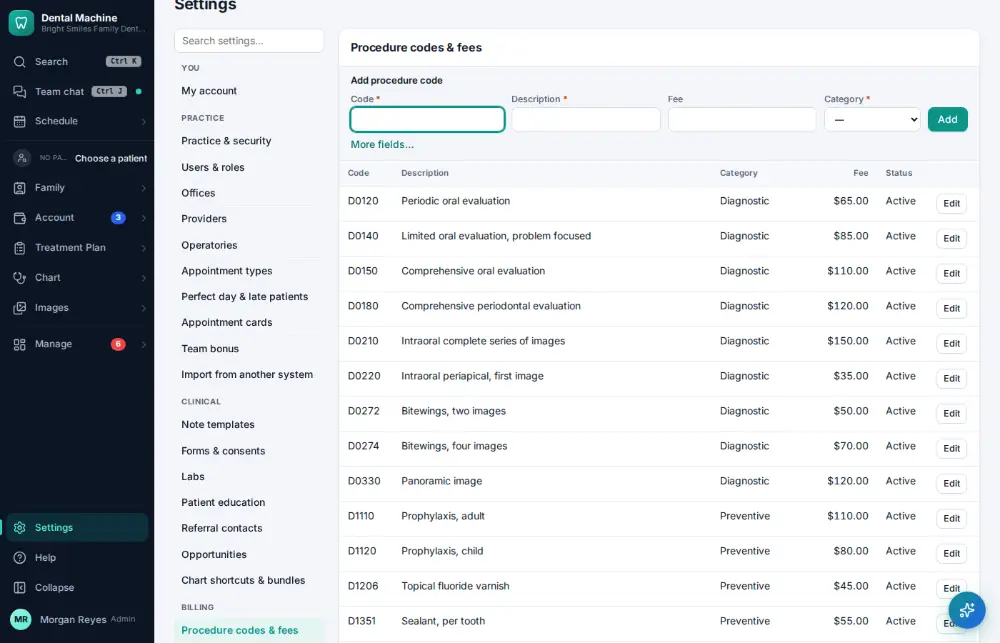
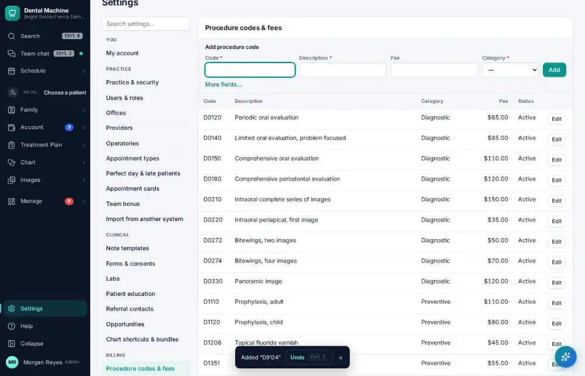

# How do I add a procedure code?

**Who:** office manager · **Where:** Settings → Procedure codes & fees · **How often:** A few times a year

Type the whole line — code, description, fee — and press Enter. The category follows from the code.

## Steps

1. Click Settings (bottom of the menu), then "Procedure codes & fees"

   

2. Type the whole line in the add box — code, description, fee — and press Enter (the category follows the code)  
   Keys: <kbd>Enter</kbd>

   

## Related

- [How do I update the office fee schedule?](A154-update-the-office-fee-schedule.md)
- [How do I add an appointment type?](A164-add-an-appointment-type.md)
- [How do I edit a form or consent?](A166-edit-a-form-or-consent.md)
- [How do I change reminder and message settings?](A167-change-reminder-and-message-settings.md)
- [How do I update an insurance fee schedule?](A155-update-an-insurance-fee-schedule.md)

---
[All how-tos](README.md) · Action A165 · screenshots from the robot run of 2026-09-25
