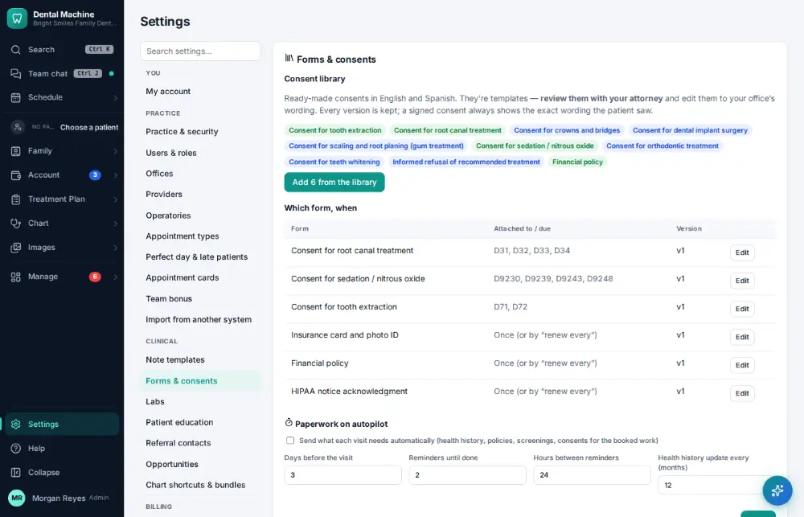
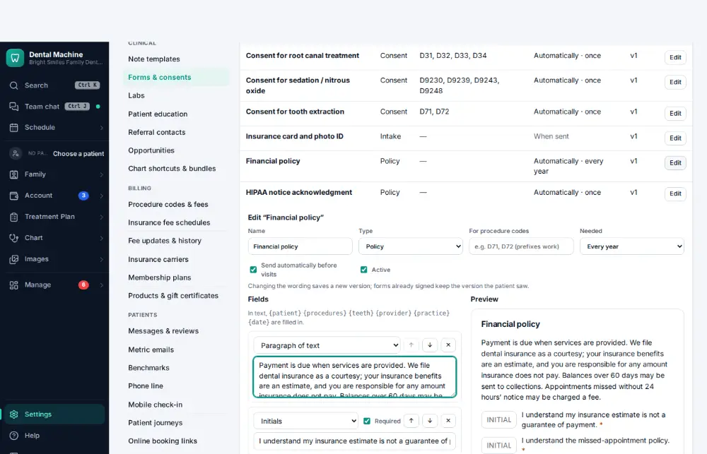
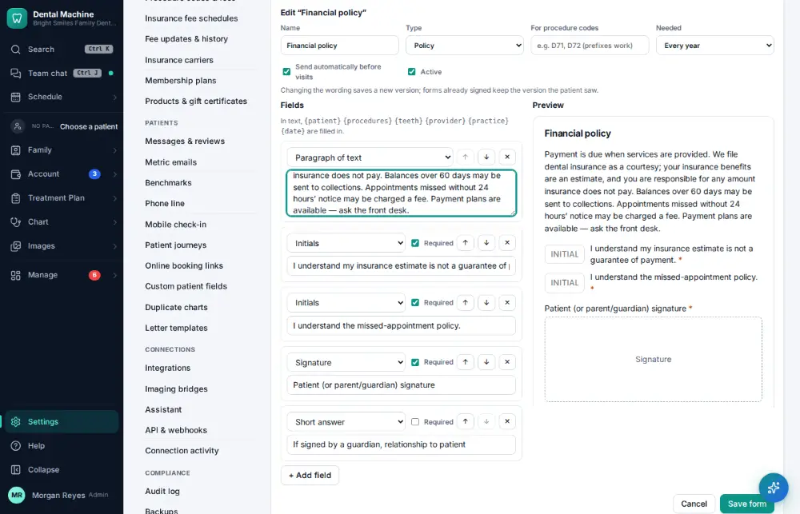
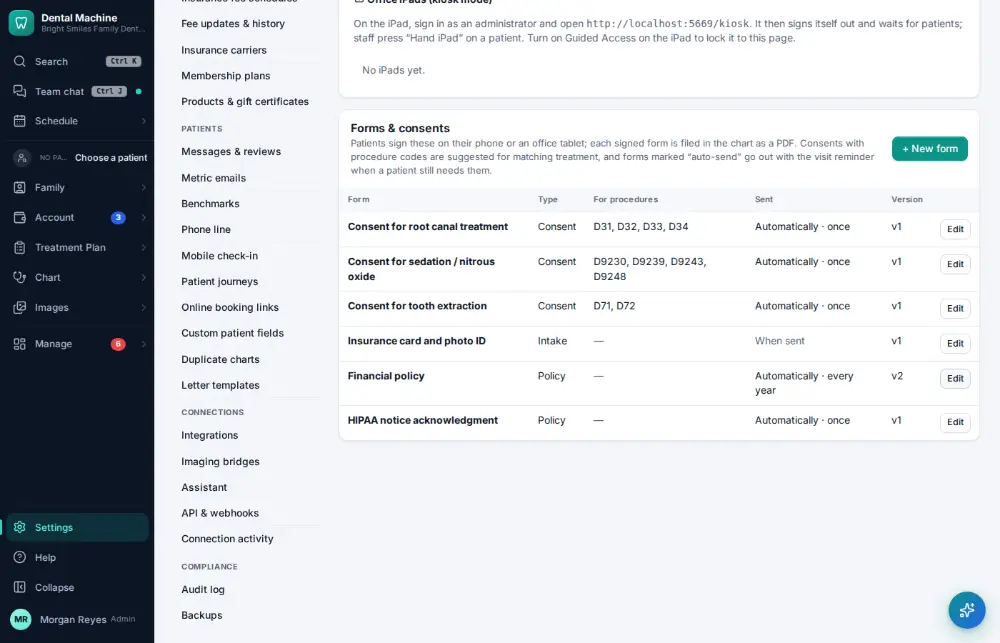

# How do I edit a form or consent?

**Who:** office manager · **Where:** Settings → Forms & consents · **How often:** A few times a year

Edit the wording of a form or consent with a live preview. Saving makes a new version; copies patients already signed keep the wording they saw.

## Steps

1. Click Settings (bottom of the menu), then "Forms & consents"

   

2. Click Edit on "Financial policy" (Forms & consents list): the wording opens under the list with a live preview, the cursor at the end of the text

   

3. Type the new sentence

   

4. Press Ctrl/⌘+Enter: saved as a new version (signed copies keep the wording the patient saw)  
   Keys: <kbd>Ctrl/⌘ Enter</kbd>

   

## Related

- [How do I have the patient sign a consent form?](A039-have-the-patient-sign-a-consent-form.md)
- [How do I send forms to a patient before the visit?](A040-send-forms-to-a-patient-before-the-visit.md)
- [How do I add an appointment type?](A164-add-an-appointment-type.md)
- [How do I add a procedure code?](A165-add-a-procedure-code.md)
- [How do I change reminder and message settings?](A167-change-reminder-and-message-settings.md)

---
[All how-tos](README.md) · Action A166 · screenshots from the robot run of 2026-09-25
