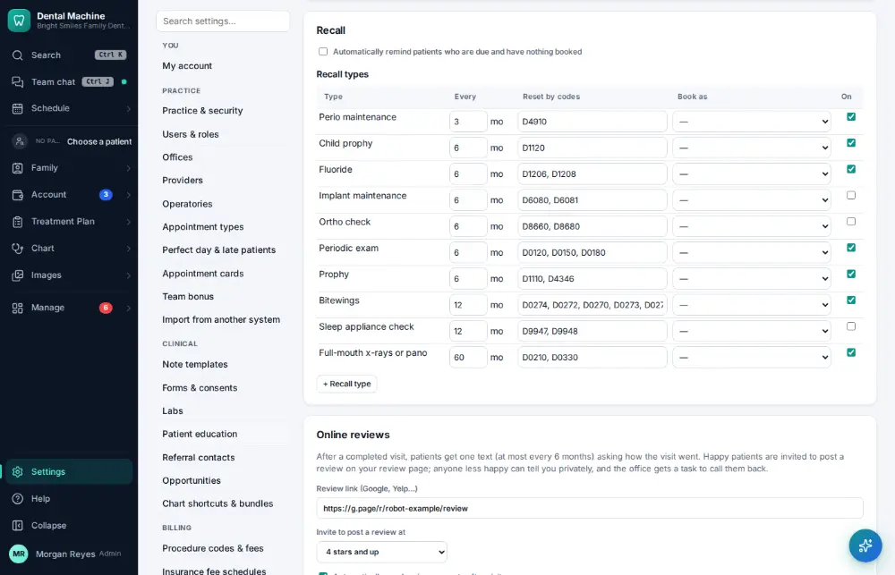
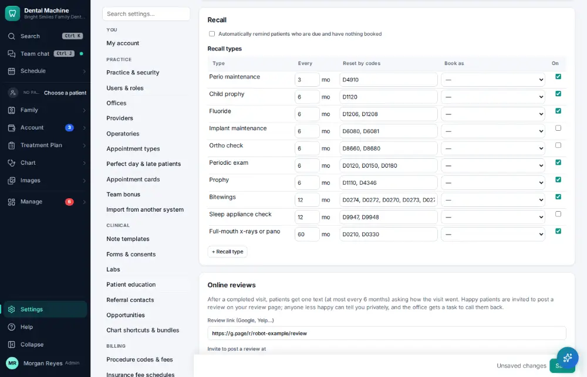

# How do I change reminder and message settings?

**Who:** office manager · **Where:** Settings → Messages & reviews · **How often:** A few times a year

Sets when reminders go out (for example a week before, then 1 or 2 days before) and the other message settings.

## Steps

1. Click Settings (bottom of the menu), then "Messages & reviews"

   

2. Change the second reminder from "2 days" to "1 day" before the visit (the Save bar comes up)

   

3. Press Ctrl/⌘+S: saved  
   Keys: <kbd>Ctrl/⌘ S</kbd>

   

## Tips

- Ctrl/⌘ S saves (the Save bar comes up when something changed).

## Related

- [How do I text a reminder to everyone unconfirmed?](A094-text-a-reminder-to-everyone-unconfirmed.md)
- [How do I confirm an appointment?](A016-confirm-an-appointment.md)
- [How do I add an appointment type?](A164-add-an-appointment-type.md)
- [How do I add a procedure code?](A165-add-a-procedure-code.md)
- [How do I edit a form or consent?](A166-edit-a-form-or-consent.md)

---
[All how-tos](README.md) · Action A167 · screenshots from the robot run of 2026-09-25
