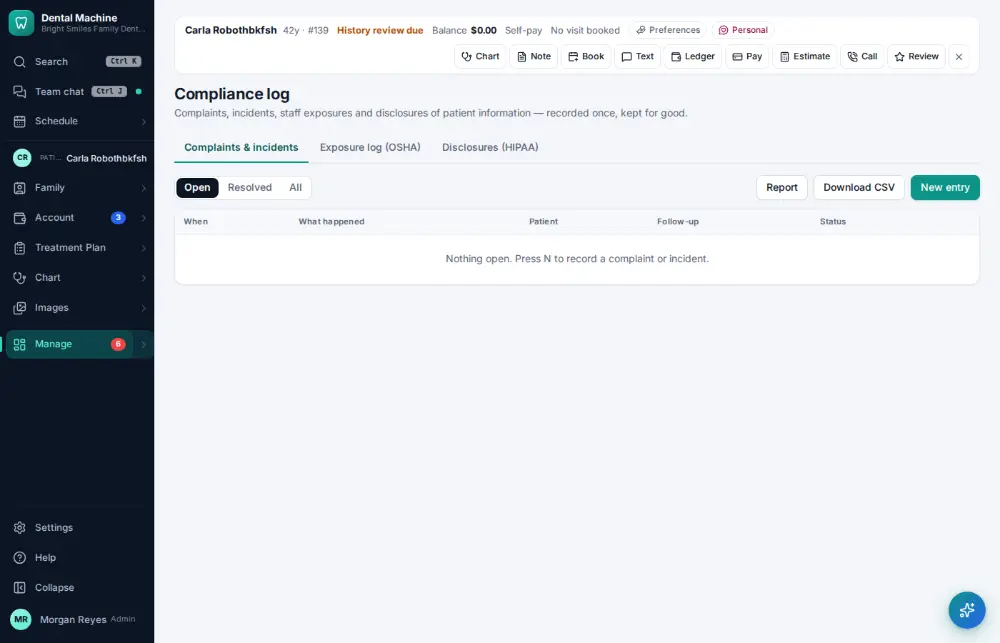
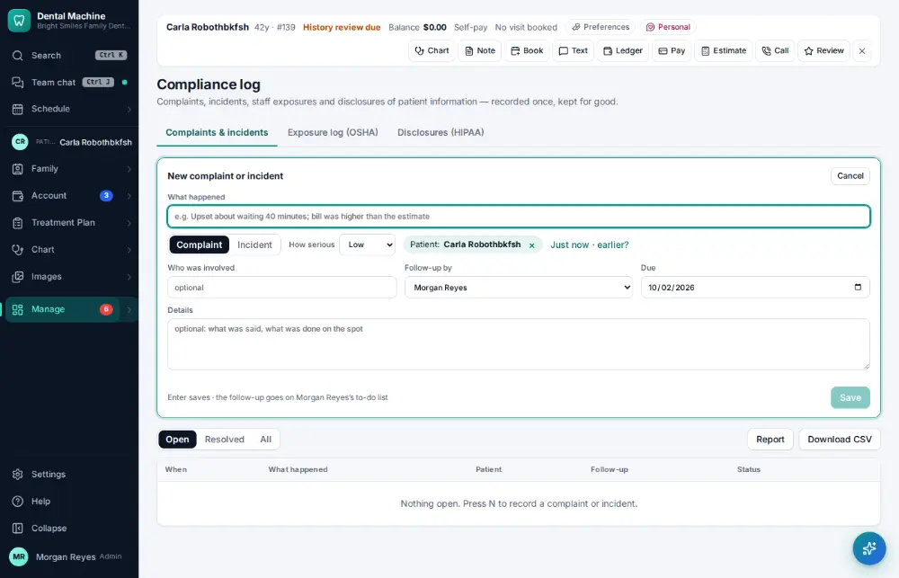
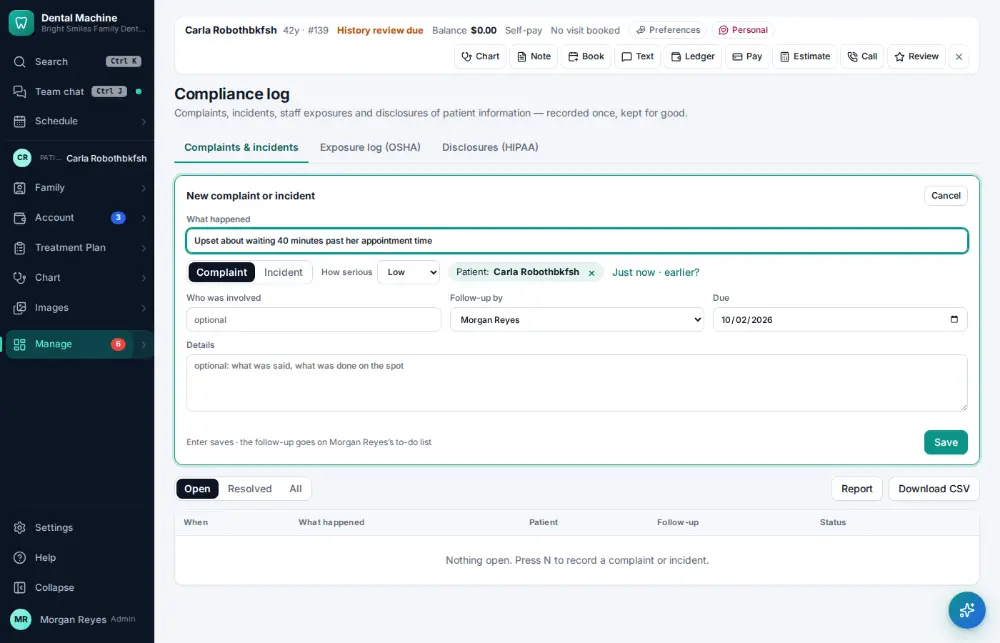
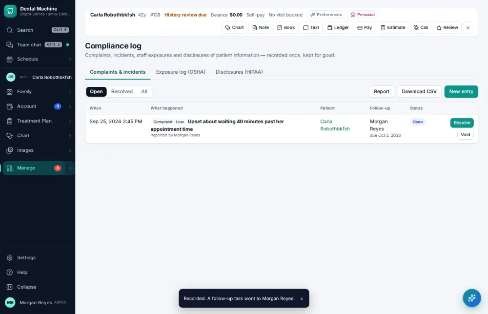

# How do I record a patient complaint or incident?

**Who:** office manager · **Where:** Manage ▾ → Compliance log → N · **How often:** A few times a year

Record a complaint or incident about the active patient; a follow-up for the manager in a week is set and put on the owner’s to-do list.

## Where to start

## Steps

1. Manage → Compliance log: press N — the form opens about the active patient, follow-up to the manager in a week  
   Keys: <kbd>N</kbd>

   

2. Type what happened

   

3. Press Enter: recorded, and the follow-up is on the owner’s to-do list  
   Keys: <kbd>Enter</kbd>

   

## Related

- [How do I log an exposure or sharps injury?](A169-log-an-exposure-or-sharps-injury.md)
- [How do I record a HIPAA disclosure?](A175-record-a-hipaa-disclosure.md)
- [How do I check that backups ran?](A159-check-that-backups-ran.md)
- [How do I look up who changed something?](A160-look-up-who-changed-something.md)
- [How do I file an office document?](A153-file-an-office-document.md)

---
[All how-tos](README.md) · Action A168 · screenshots from the robot run of 2026-09-25
