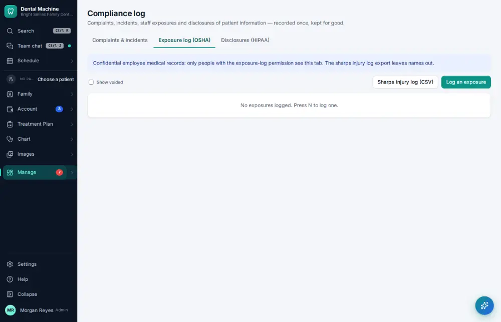
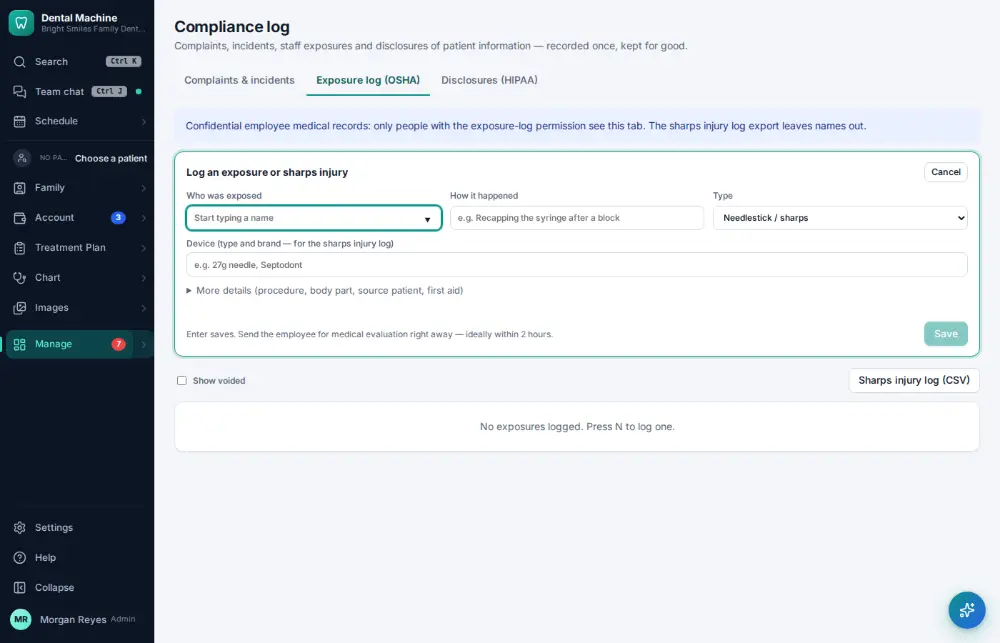
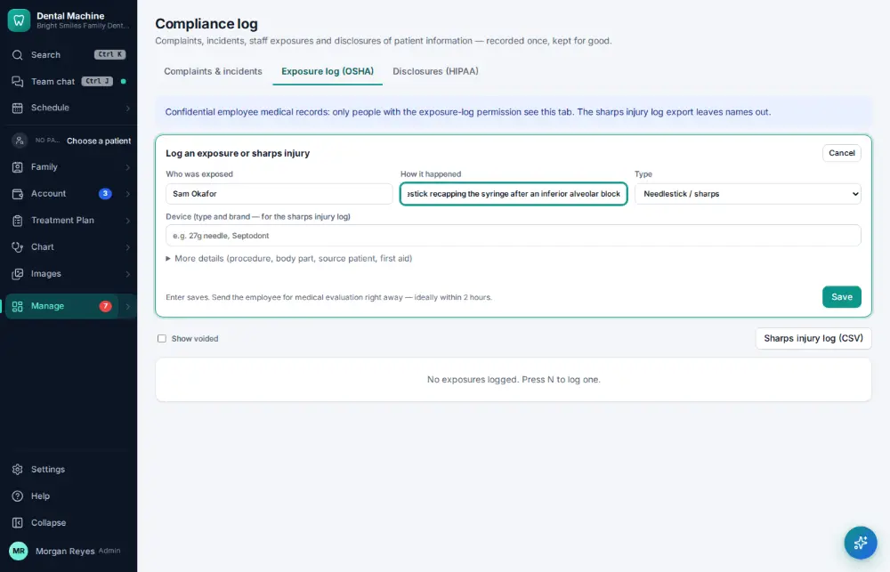
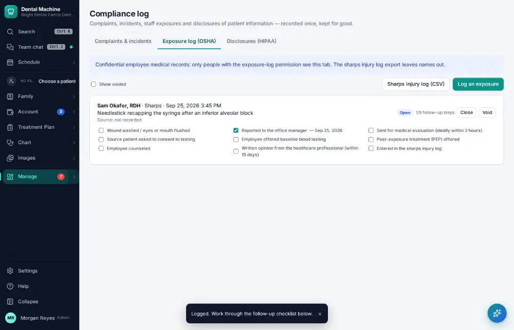

# How do I log an exposure or sharps injury?

**Who:** office manager · **Where:** Manage ▾ → Compliance log → Exposure log → N · **How often:** A few times a year

Log a needle-stick or other exposure with the post-exposure checklist (“reported today” is already ticked).

## Where to start

## Steps

1. Compliance log → Exposure log: press N  
   Keys: <kbd>N</kbd>

   

2. Type who was exposed, Tab, how it happened  
   Keys: <kbd>Tab</kbd>

   

3. Press Enter: logged with the post-exposure checklist (reported today is already ticked)  
   Keys: <kbd>Enter</kbd>

   

## Related

- [How do I record a patient complaint or incident?](A168-record-a-patient-complaint-or-incident.md)
- [How do I log a sterilizer spore test?](A132-log-a-sterilizer-spore-test.md)
- [How do I check that backups ran?](A159-check-that-backups-ran.md)
- [How do I look up who changed something?](A160-look-up-who-changed-something.md)
- [How do I record a HIPAA disclosure?](A175-record-a-hipaa-disclosure.md)

---
[All how-tos](README.md) · Action A169 · screenshots from the robot run of 2026-09-25
