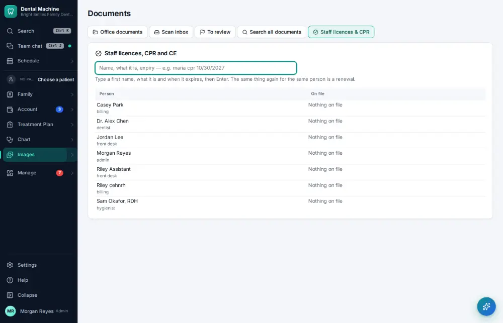
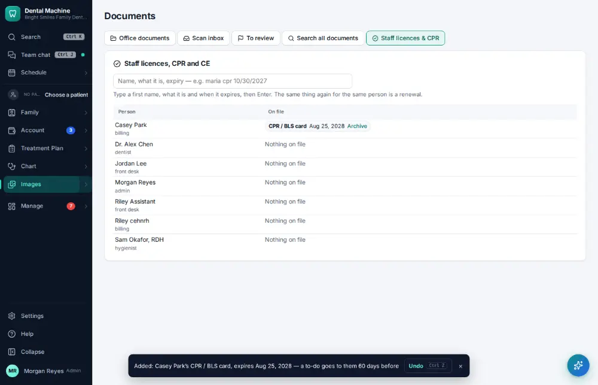

# How do I track staff licenses, CPR and CE due dates?

**Who:** office manager · **Where:** Images ▾ → Office documents → Staff licences (command bar “Staff licences”) · **How often:** A few times a year

Documents → Staff licences keeps everyone’s licence, CPR card, DEA, radiology permit and CE deadline on one screen, with how long is left. One line adds or renews one: a first name, what it is and the expiry date — “casey cpr 08/25/2028” (add “#12345” for a number). The person gets a to-do 60 days before it expires (90 for CE).

## Where to start

## Steps

1. Documents → Staff licences: type "casey cpr 08/25/2028" and press Enter: on their row, with a to-do for them 60 days before  
   Keys: <kbd>Enter</kbd>

   

## Tips

- Due and expired ones are listed first.
- Undo on the notice takes the line back.
- File a scan of the card itself in Office documents ([A153](A153-file-an-office-document.md)) if you want the copy on record.

## Related

- [How do I file an office document?](A153-file-an-office-document.md)
- [How do I add a staff member's login?](A156-add-a-staff-member-s-login.md)
- [How do I set up the team bonus?](A162-set-up-the-team-bonus.md)
- [How do I export payroll?](A138-export-payroll.md)
- [How do I request time off?](A133-request-time-off.md)

---
[All how-tos](README.md) · Action A170 · screenshots from the robot run of 2026-09-25
