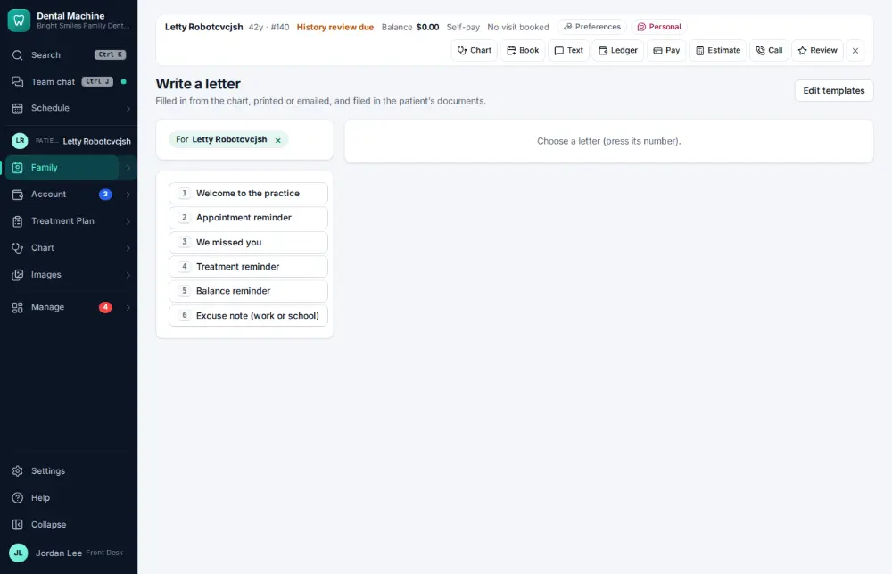
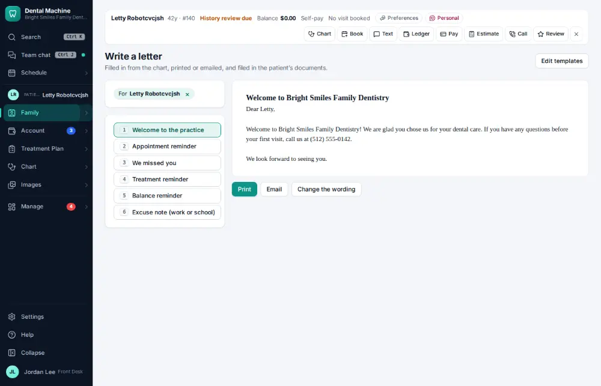
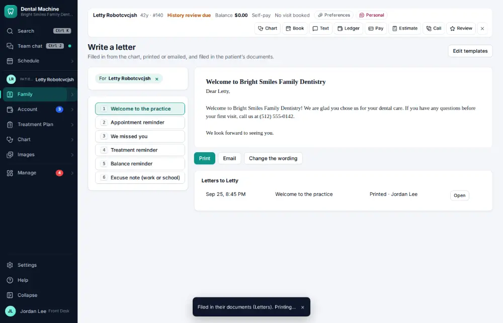

# How do I write a letter to a patient from a template?

**Who:** front desk · **Where:** Family ▾ → Letters · **How often:** A few times a year

Letters for the active patient are numbered: press the number to fill one in from the chart, Enter to print it (it is filed on the chart), M to email it.

## Where to start

## Steps

1. Family → Letters (for the active patient): press 1 — the welcome letter, filled in from the chart  
   Keys: <kbd>1</kbd>

   

2. Press Enter: filed in their documents (Letters) and opened to print  
   Keys: <kbd>Enter</kbd>

   

## Tips

- E changes the wording for this one letter; the templates are in Settings → Letter templates.

## Related

- [How do I print mailing labels?](A177-print-mailing-labels.md)
- [How do I refer a patient to a specialist?](A089-refer-a-patient-to-a-specialist.md)
- [How do I send a newsletter or campaign?](A136-send-a-newsletter-or-campaign.md)
- [How do I read patient feedback?](A130-read-patient-feedback.md)
- [How do I reply to an online review?](A116-reply-to-an-online-review.md)

---
[All how-tos](README.md) · Action A171 · screenshots from the robot run of 2026-09-25
