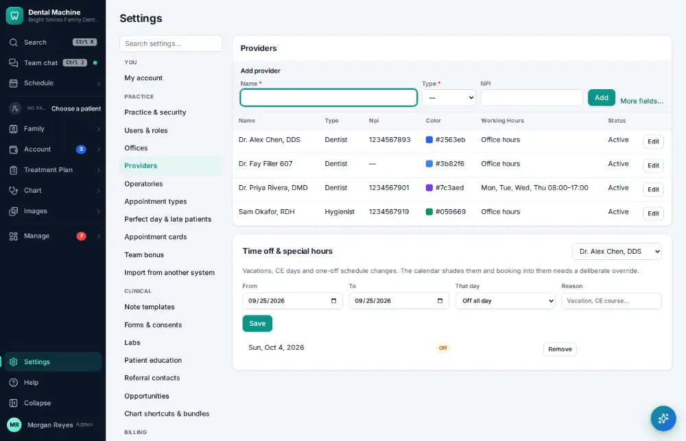
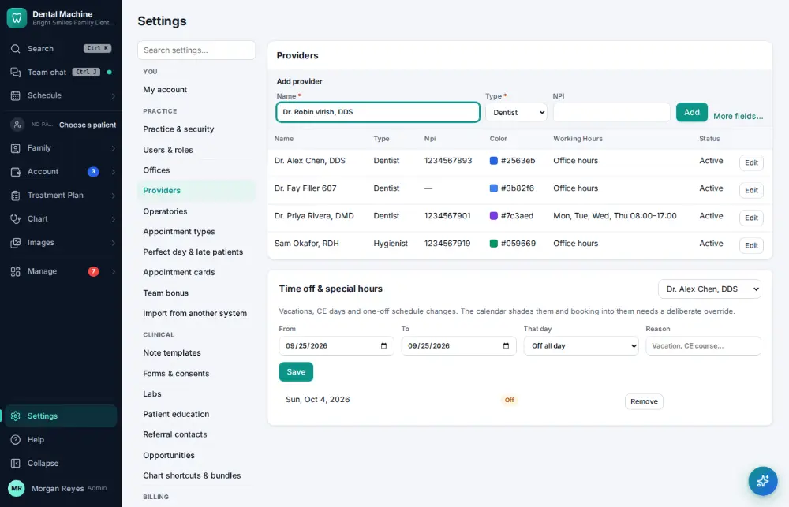
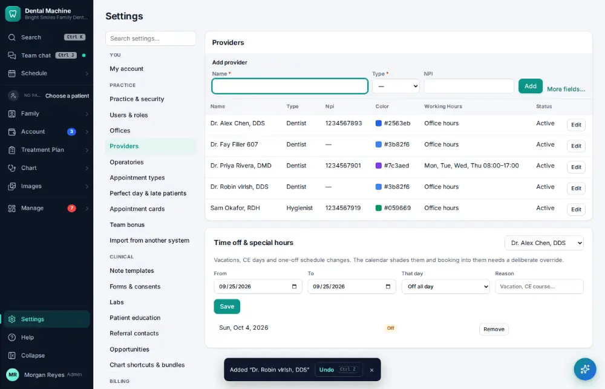

# How do I add a provider?

**Who:** office manager · **Where:** Settings → Providers · **How often:** A few times a year

Add a dentist or hygienist so they can be booked and credited with production.

## Steps

1. Click Settings (bottom of the menu), then "Providers"

   

2. Type the new provider: Name, Type (the cursor is already in the add line)

   

3. Press Enter: added (Undo on the toast)  
   Keys: <kbd>Enter</kbd>

   

## Tips

- Undo on the notice removes it again.

## Related

- [How do I add an operatory?](A173-add-an-operatory.md)
- [How do I add a staff member's login?](A156-add-a-staff-member-s-login.md)
- [How do I give a provider a day off or change their hours?](A120-give-a-provider-a-day-off-or-change-their-hours.md)
- [How do I change my password?](A174-change-my-password.md)
- [How do I add an appointment type?](A164-add-an-appointment-type.md)

---
[All how-tos](README.md) · Action A172 · screenshots from the robot run of 2026-09-25
