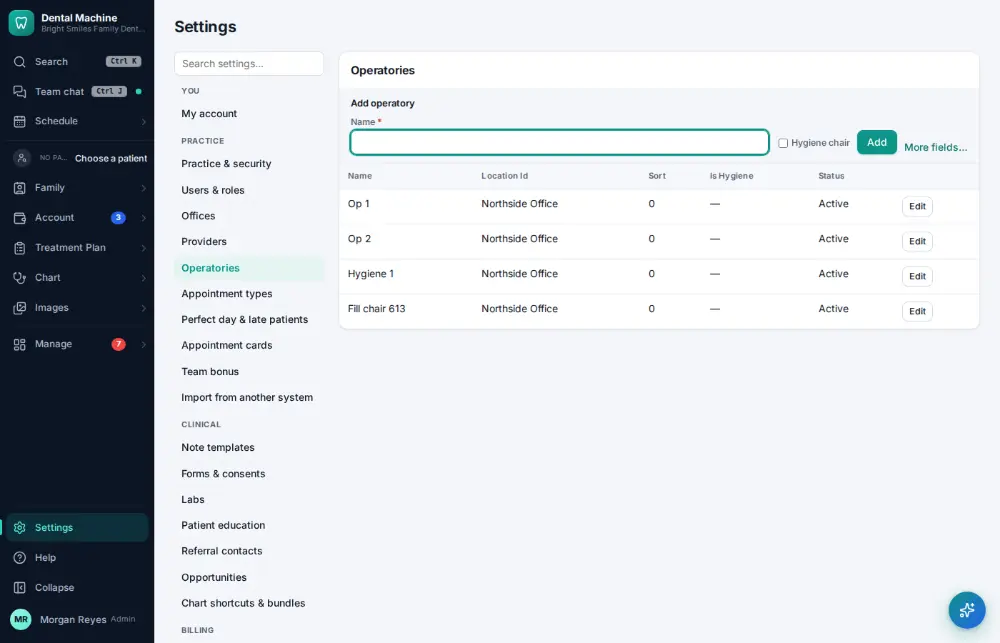
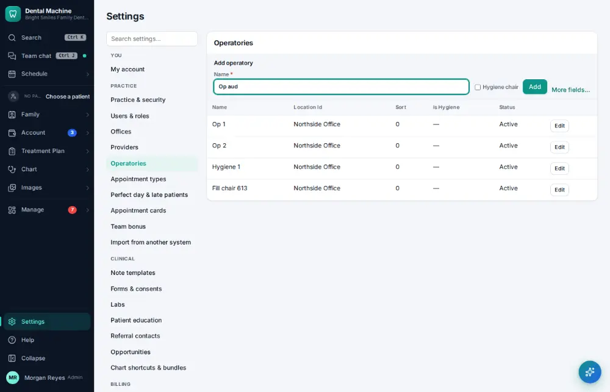
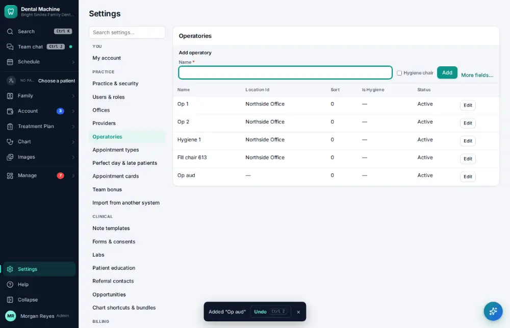

# How do I add an operatory?

**Who:** office manager · **Where:** Settings → Operatories · **How often:** A few times a year

Add a chair (operatory) so it shows as a column on the schedule.

## Steps

1. Click Settings (bottom of the menu), then "Operatories"

   

2. Type the new chair: Name (the cursor is already in the add line)

   

3. Press Enter: added (Undo on the toast)  
   Keys: <kbd>Enter</kbd>

   

## Related

- [How do I add a provider?](A172-add-a-provider.md)
- [How do I switch the schedule between chairs, providers or one provider?](A009-switch-the-schedule-between-chairs-providers-or-one-provider.md)
- [How do I change my password?](A174-change-my-password.md)
- [How do I add an appointment type?](A164-add-an-appointment-type.md)
- [How do I add a procedure code?](A165-add-a-procedure-code.md)

---
[All how-tos](README.md) · Action A173 · screenshots from the robot run of 2026-09-25
