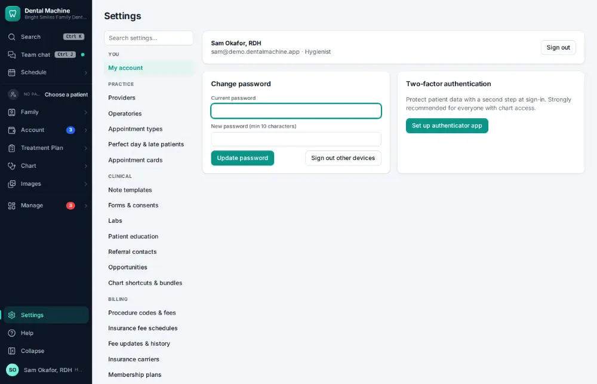
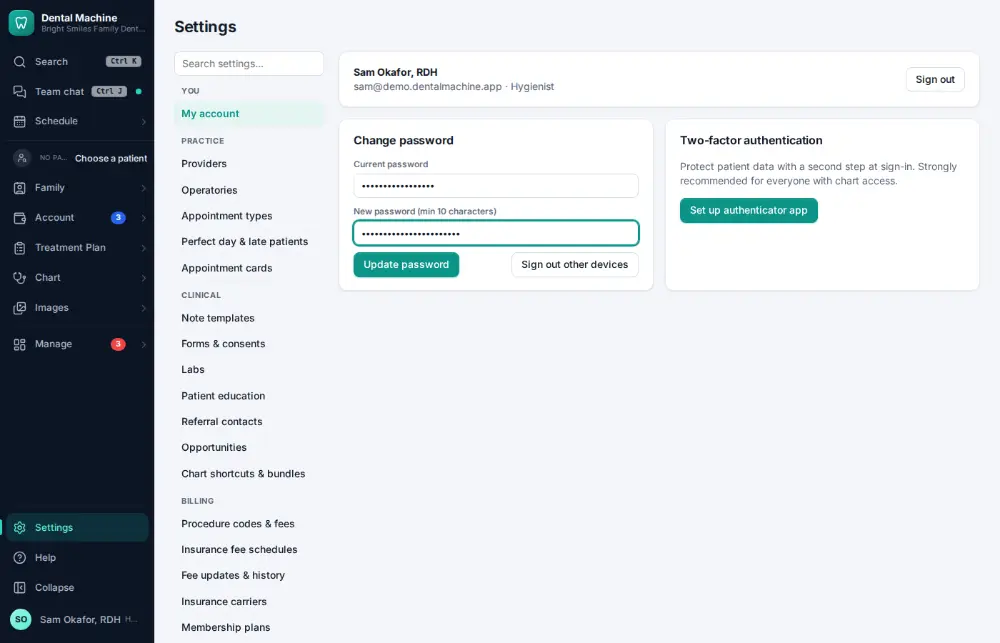

# How do I change my password?

**Who:** everyone · **Where:** Settings → My account · **How often:** A few times a year

Change your own password: type the current one, then the new one (at least 10 characters).

## Steps

1. Click Settings (bottom of the menu), then "My account"

   

2. Type the current password (the cursor is already there), Tab, the new one  
   Keys: <kbd>Tab</kbd>

   

## If something goes wrong

- **The new password is refused** — It needs at least 10 characters.

## Related

- [How do I turn on two-step sign-in?](A181-turn-on-two-step-sign-in.md)
- [How do I add a provider?](A172-add-a-provider.md)
- [How do I add an operatory?](A173-add-an-operatory.md)
- [How do I add an appointment type?](A164-add-an-appointment-type.md)
- [How do I add a procedure code?](A165-add-a-procedure-code.md)

---
[All how-tos](README.md) · Action A174 · screenshots from the robot run of 2026-09-25
