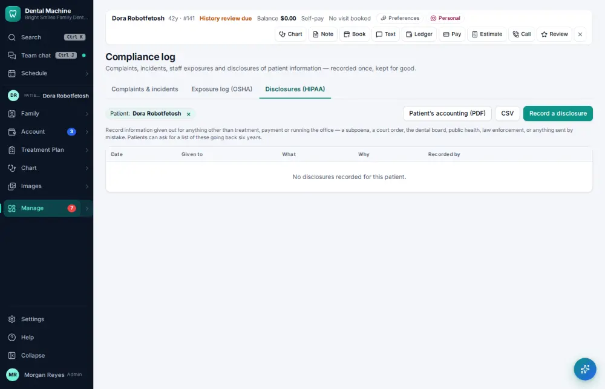
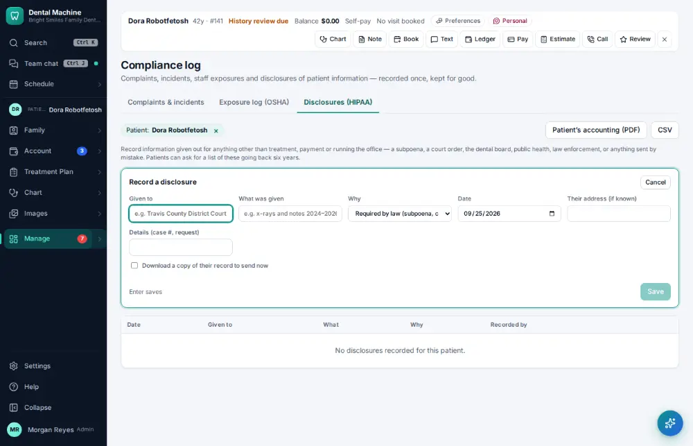
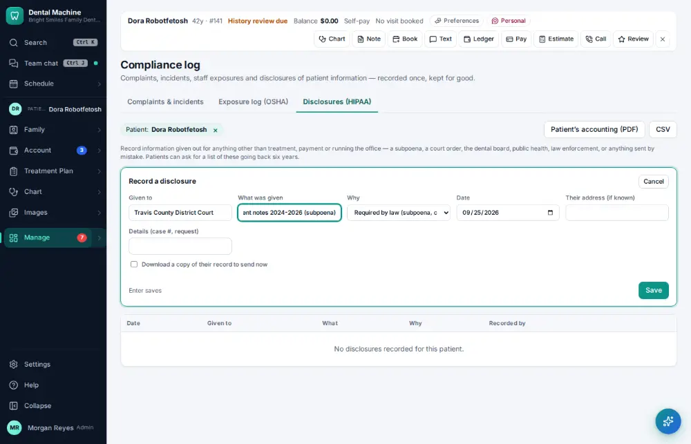
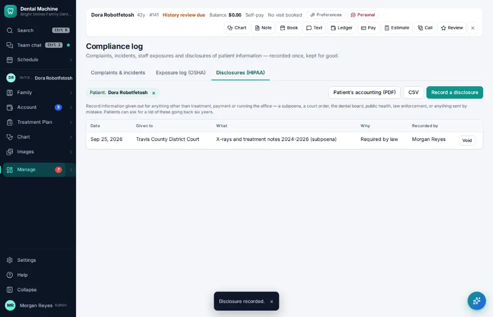

# How do I record a HIPAA disclosure?

**Who:** office manager · **Where:** Manage ▾ → Compliance log → Disclosures → N · **How often:** A few times a year

Record that you gave a patient’s information to someone (a lawyer, another office…). It goes on the patient’s accounting of disclosures. The reason defaults to the last one used.

## Where to start

## Steps

1. Compliance log → Disclosures (the active patient is chosen): press N  
   Keys: <kbd>N</kbd>

   

2. Type who it went to, Tab, what was given (the reason defaults to the last one used)  
   Keys: <kbd>Tab</kbd>

   

3. Press Enter: recorded for the patient’s accounting of disclosures  
   Keys: <kbd>Enter</kbd>

   

## Tips

- “Send the record to someone else…” on the chart’s ⋯ menu records the disclosure for you.

## Related

- [How do I give a patient a copy of their record?](A141-give-a-patient-a-copy-of-their-record.md)
- [How do I record a patient complaint or incident?](A168-record-a-patient-complaint-or-incident.md)
- [How do I log an exposure or sharps injury?](A169-log-an-exposure-or-sharps-injury.md)
- [How do I check that backups ran?](A159-check-that-backups-ran.md)
- [How do I look up who changed something?](A160-look-up-who-changed-something.md)

---
[All how-tos](README.md) · Action A175 · screenshots from the robot run of 2026-09-25
