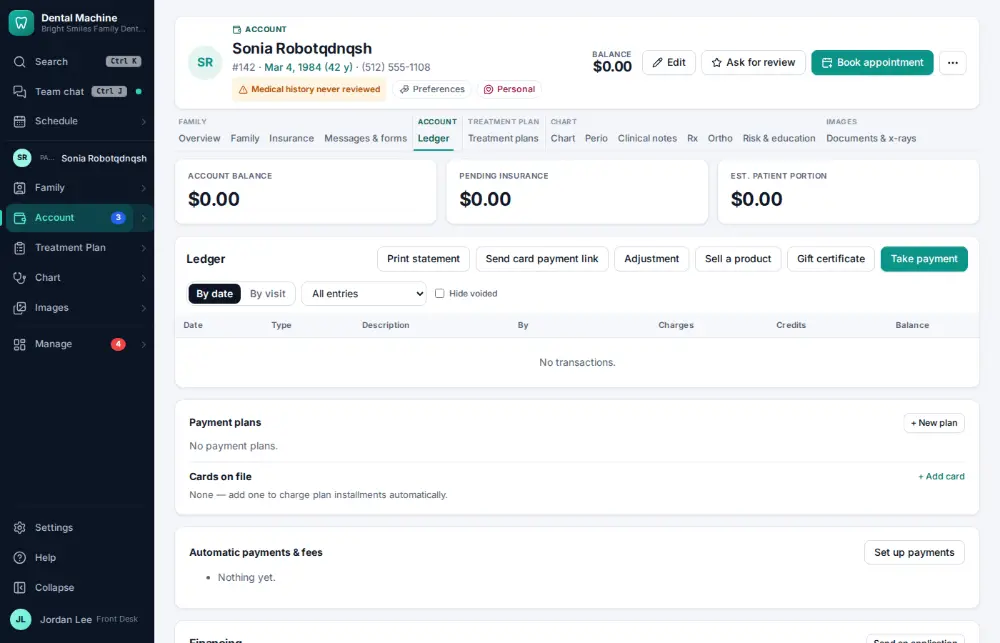
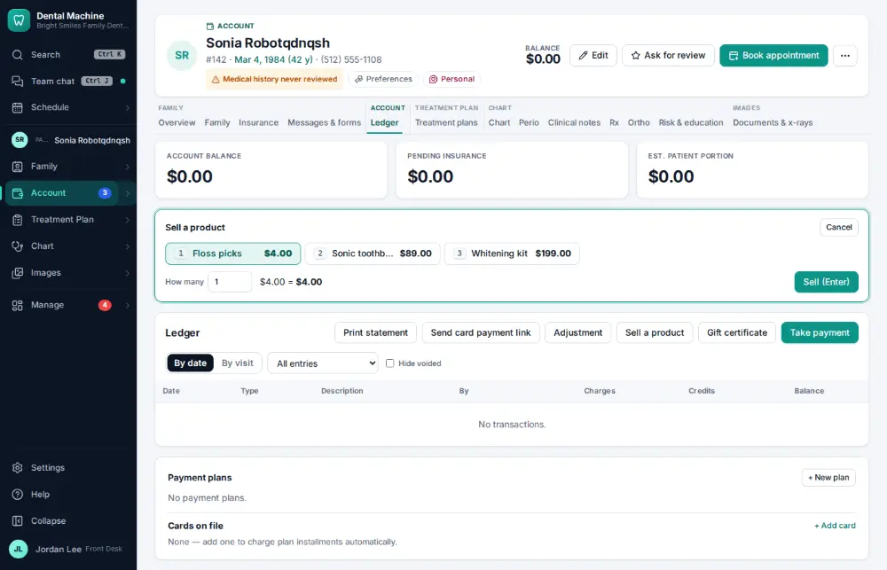
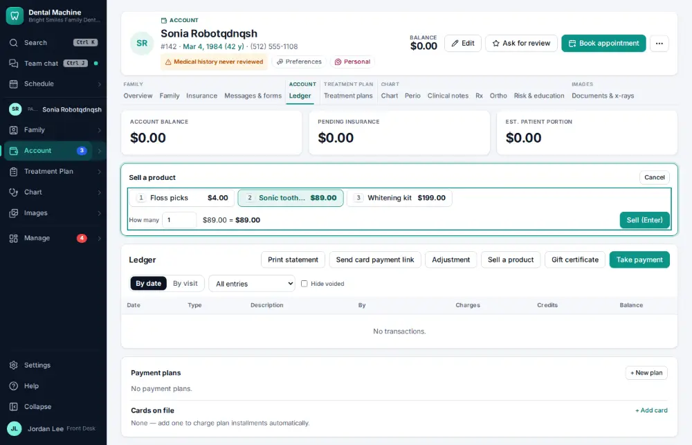
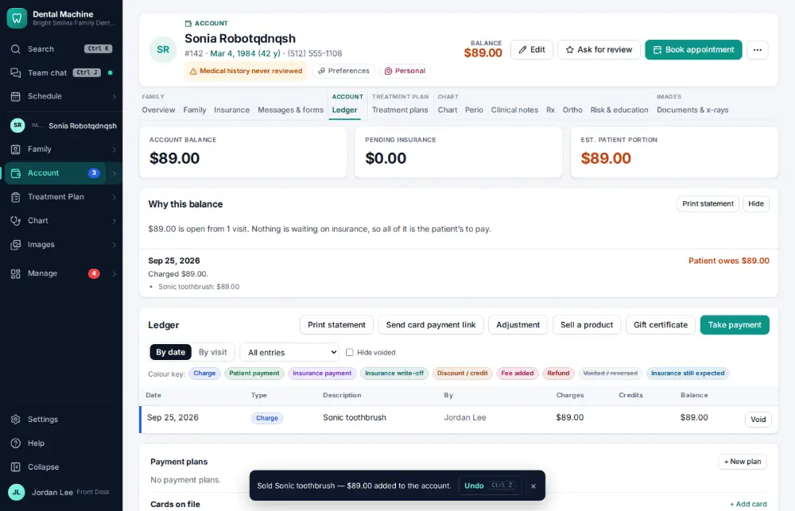

# How do I sell a product?

**Who:** front desk · **Where:** Account (ledger) → Sell a product · **How often:** A few times a year

Sell a product from the patient’s account: press its number, then Enter. Tax is worked out and it goes on the account as a charge.

## Where to start

## Steps

1. Account (ledger): click "Sell a product" — the products, with prices, and the first one chosen

   

2. Press 2 for the sonic toothbrush (quantity 1, tax worked out)  
   Keys: <kbd>2</kbd>

   

3. Press Enter: on the account as a charge, with Undo  
   Keys: <kbd>Enter</kbd>

   

## Tips

- Undo on the notice takes it back. Products and sales tax are set in Settings → Products for sale.

## Related

- [How do I take a patient payment?](A019-take-a-patient-payment.md)
- [How do I sell or redeem a gift certificate?](A184-sell-or-redeem-a-gift-certificate.md)
- [How do I send an account to collections?](A147-send-an-account-to-collections.md)
- [How do I send patient statements?](A119-send-patient-statements.md)
- [How do I reconcile insurance payments with the bank?](A127-reconcile-insurance-payments-with-the-bank.md)

---
[All how-tos](README.md) · Action A176 · screenshots from the robot run of 2026-09-25
