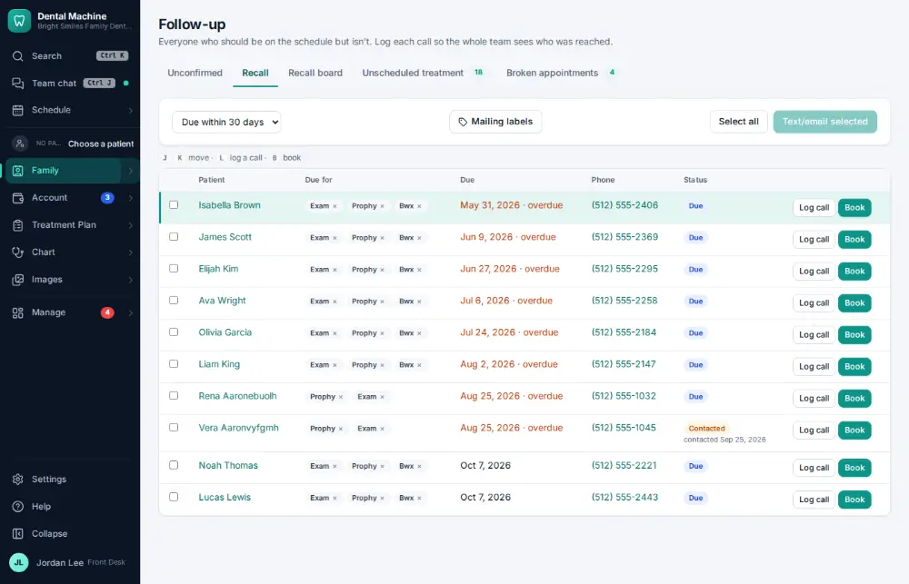
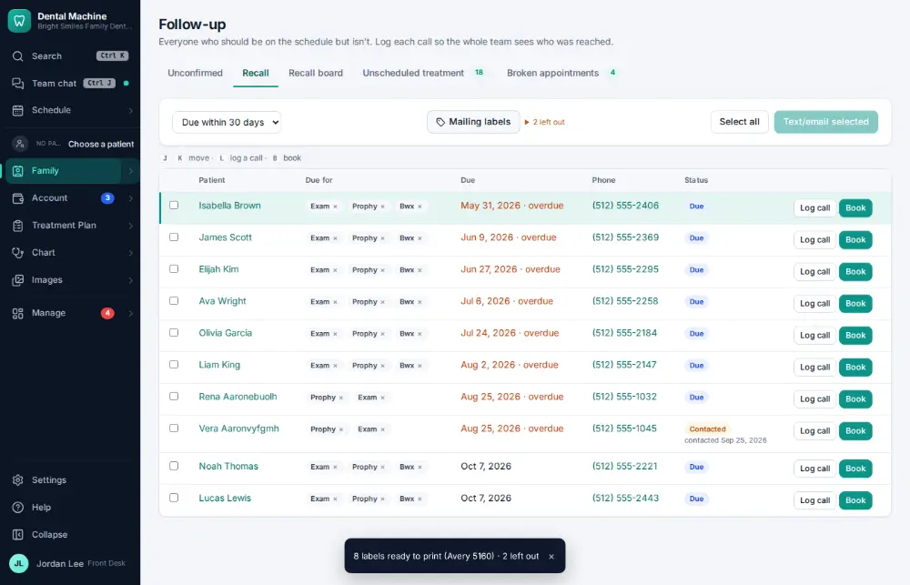

# How do I print mailing labels?

**Who:** front desk · **Where:** Follow-up → Recall (also on report results and a campaign’s audience) → Mailing labels · **How often:** A few times a year

Prints an Avery 5160 sheet of labels for everyone on the list.

## Where to start

## Steps

1. Follow-up → Recall: click "Mailing labels" — an Avery 5160 sheet for everyone listed opens to print

   

## Related

- [How do I call a patient who is due for recall?](A037-call-a-patient-who-is-due-for-recall.md)
- [How do I send a newsletter or campaign?](A136-send-a-newsletter-or-campaign.md)
- [How do I write a letter to a patient from a template?](A171-write-a-letter-to-a-patient-from-a-template.md)
- [How do I read patient feedback?](A130-read-patient-feedback.md)
- [How do I reply to an online review?](A116-reply-to-an-online-review.md)

---
[All how-tos](README.md) · Action A177 · screenshots from the robot run of 2026-09-25
