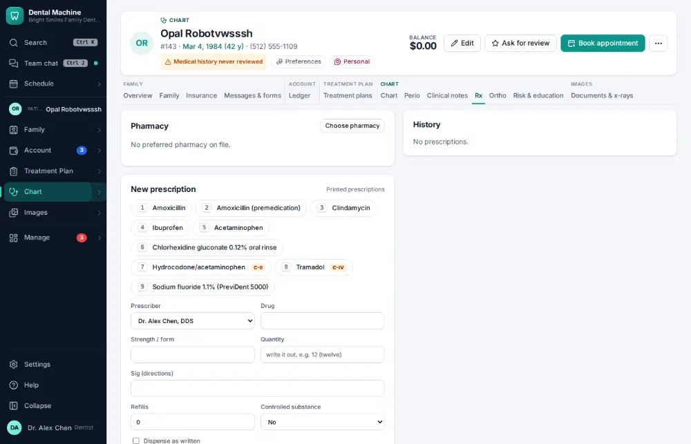
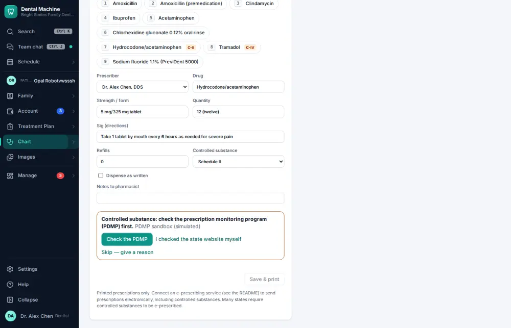
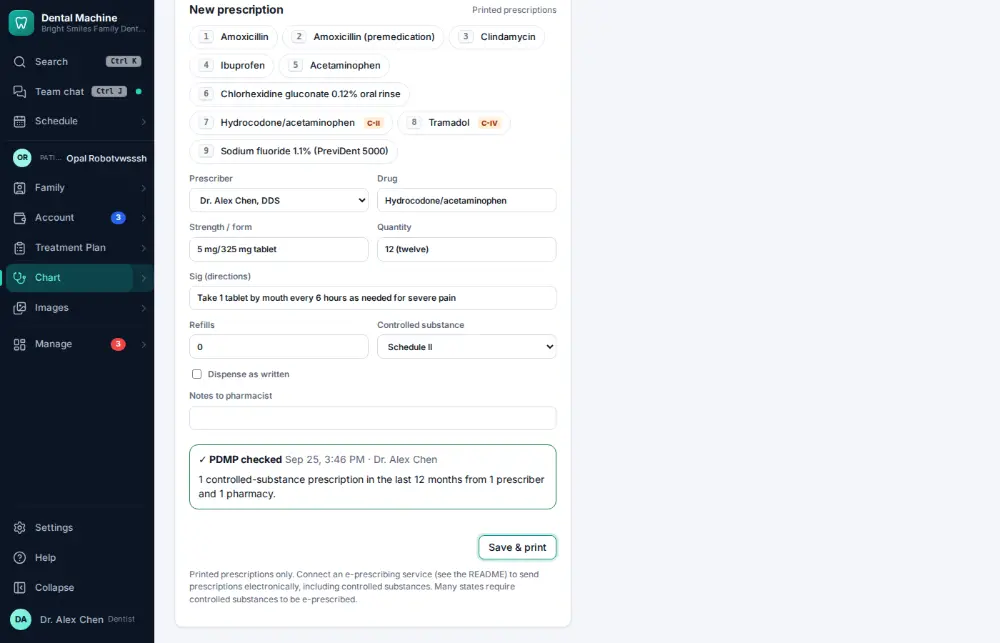
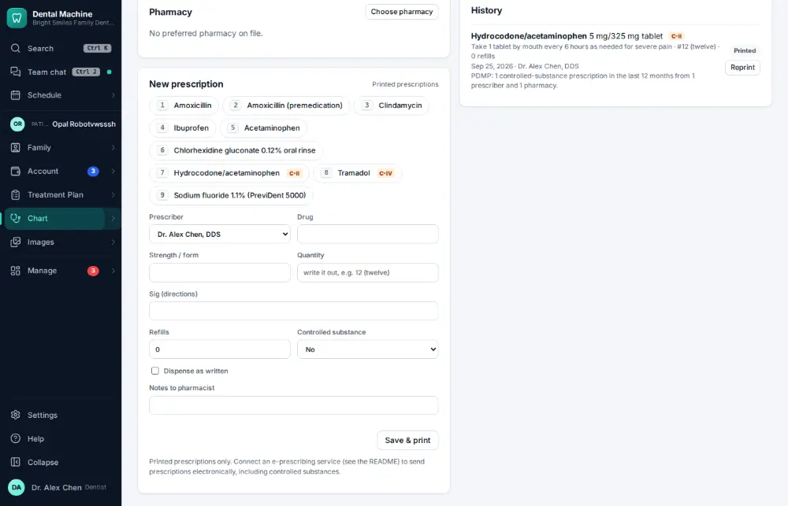

# How do I check the prescription monitoring program before an opioid?

**Who:** dentist · **Where:** Chart ▾ → Rx tab · **How often:** A few times a year

Before a controlled drug is prescribed, the state prescription monitoring program (PDMP) is checked; the result is saved with the prescription.

## Where to start

## Steps

1. Chart → Rx: press 7 (hydrocodone) — a controlled substance, so "Check the PDMP" comes first and has the focus  
   Keys: <kbd>7</kbd>

   

2. Press Enter: the state program answers (in the demo, the sandbox) and the result is shown  
   Keys: <kbd>Enter</kbd>

   

3. Press Enter: saved with the check on it, and opened to print  
   Keys: <kbd>Enter</kbd>

   

## Tips

- The demo office uses the PDMP sandbox.

## Related

- [How do I write a prescription?](A062-write-a-prescription.md)
- [How do I refer a patient to a specialist?](A089-refer-a-patient-to-a-specialist.md)
- [How do I print a treatment plan?](A096-print-a-treatment-plan.md)
- [How do I record an orthodontic adjustment visit?](A101-record-an-orthodontic-adjustment-visit.md)
- [How do I record a caries risk assessment?](A068-record-a-caries-risk-assessment.md)

---
[All how-tos](README.md) · Action A178 · screenshots from the robot run of 2026-09-25
