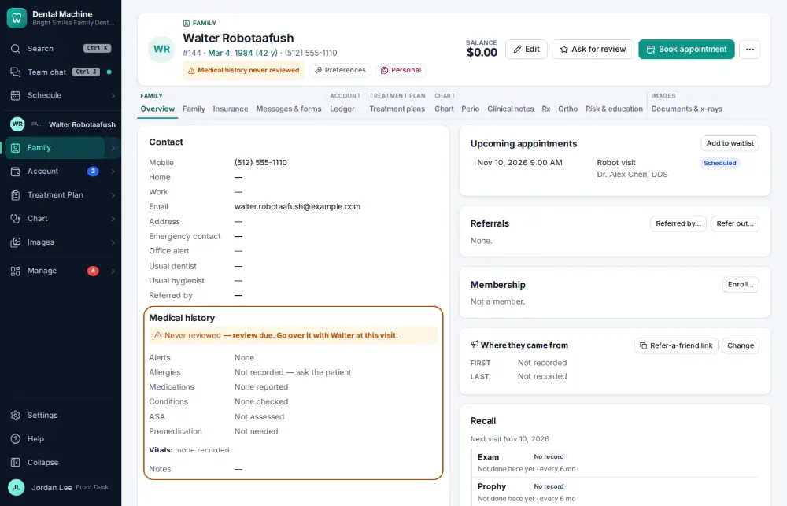
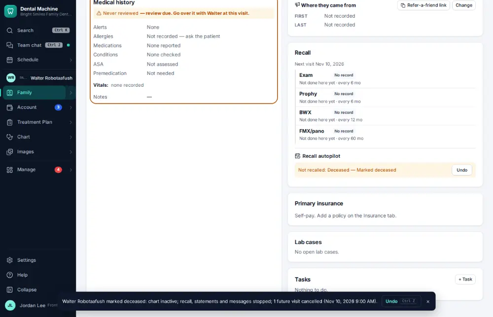

# How do I mark a patient deceased?

**Who:** front desk · **Where:** Family module → Overview → Recall → Don’t recall… → Deceased · **How often:** A few times a year

Mark a patient deceased from the Recall box on their chart. The chart becomes inactive, recall reminders, statements and messages stop, and any future visit is cancelled — with Undo on the notice. The record itself is kept.

## Where to start

## Steps

1. Chart overview → Recall: "Don’t recall…" → Deceased: chart inactive, recall, statements and messages stopped, the future visit cancelled — with Undo

   

## Related

- [How do I make a patient inactive?](A117-make-a-patient-inactive.md)
- [How do I correct a patient's name or date of birth?](A143-correct-a-patient-s-name-or-date-of-birth.md)
- [How do I merge duplicate patient charts?](A121-merge-duplicate-patient-charts.md)
- [How do I add a family member to a household?](A090-add-a-family-member-to-a-household.md)
- [How do I record who referred a new patient?](A092-record-who-referred-a-new-patient.md)

---
[All how-tos](README.md) · Action A179 · screenshots from the robot run of 2026-09-25
