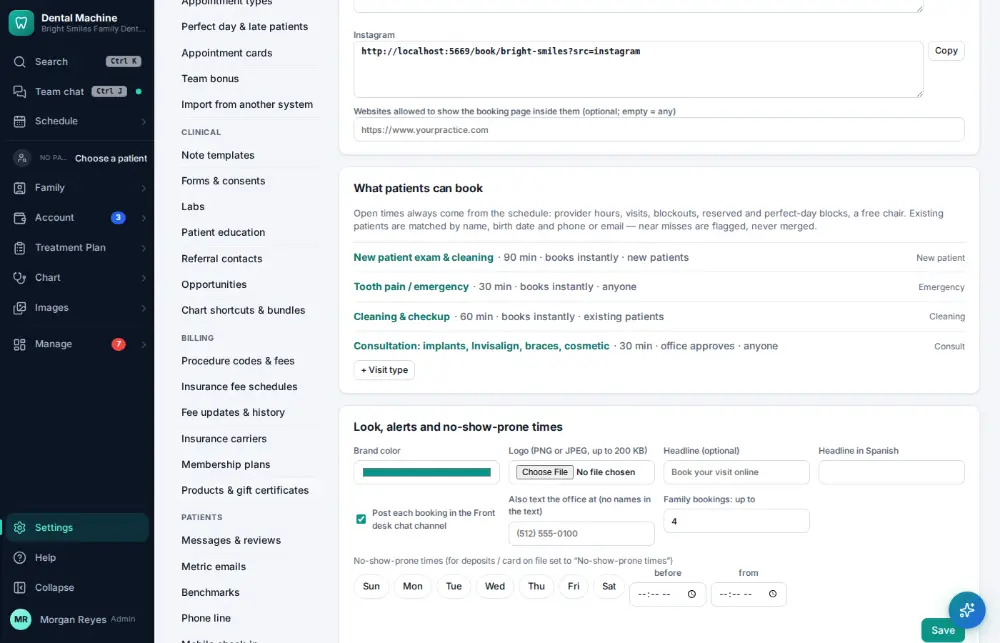
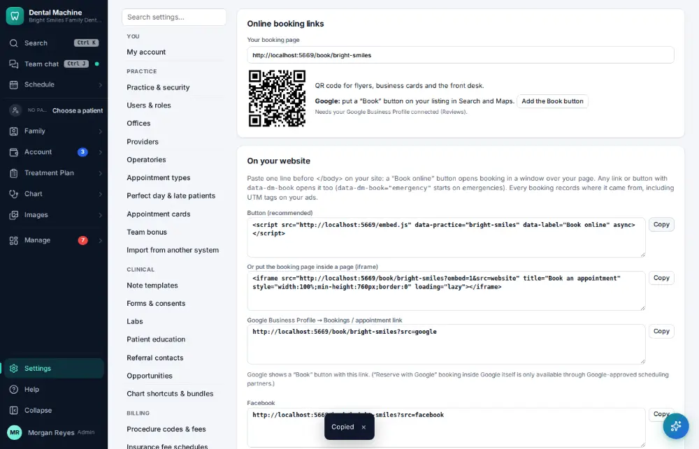

# How do I set up an online booking link?

**Who:** office manager · **Where:** Settings → Online booking links · **How often:** A few times a year

Your online booking page, a button to paste into your website, a QR code, and “Add the Book button” for your Google listing.

## Steps

1. Click Settings (bottom of the menu), then "Online booking links"

   

2. Click "Copy" beside the website button (one line to paste before </body>); the booking page link and its QR code are above

   

## Related

- [How do I accept an online booking request?](A058-accept-an-online-booking-request.md)
- [How do I turn on two-step sign-in?](A181-turn-on-two-step-sign-in.md)
- [How do I connect an imaging bridge or integration?](A182-connect-an-imaging-bridge-or-integration.md)
- [How do I import data from another system?](A183-import-data-from-another-system.md)
- [How do I add a provider?](A172-add-a-provider.md)

---
[All how-tos](README.md) · Action A180 · screenshots from the robot run of 2026-09-25
