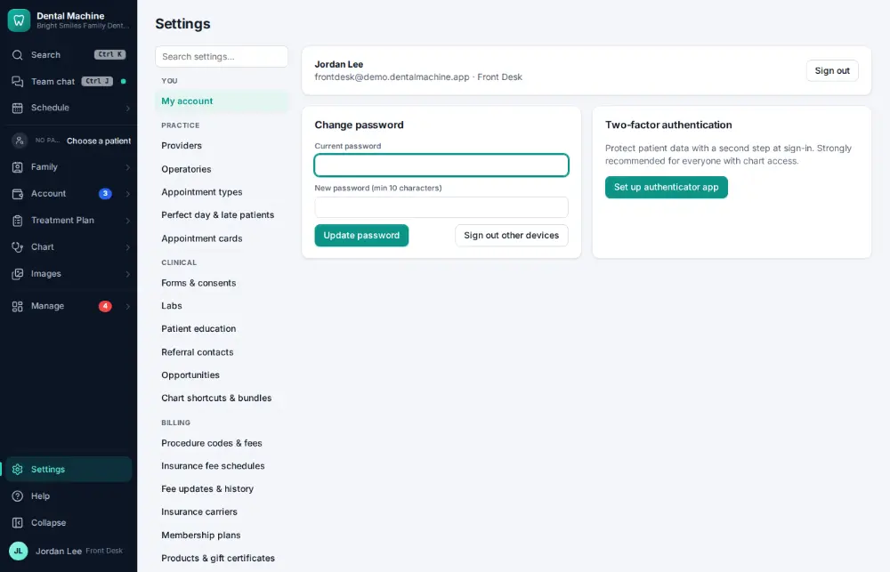
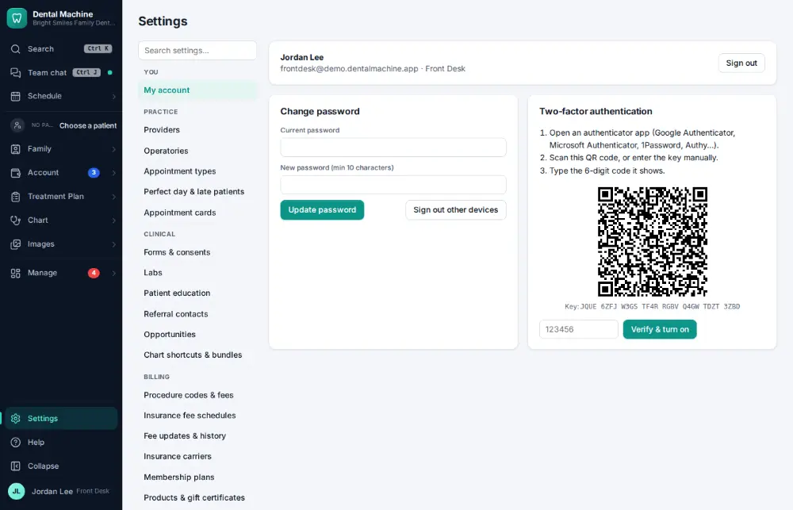

# How do I turn on two-step sign-in?

**Who:** everyone · **Where:** Settings → My account → Set up authenticator app · **How often:** A few times a year

Two-step sign-in asks for a code from your phone as well as your password. Scan the QR code with an authenticator app and type the code it shows.

## Steps

1. Click Settings (bottom of the menu), then "My account"

   

2. Click "Set up authenticator app": a QR code to scan with the phone

   

## Related

- [How do I change my password?](A174-change-my-password.md)
- [How do I set up an online booking link?](A180-set-up-an-online-booking-link.md)
- [How do I connect an imaging bridge or integration?](A182-connect-an-imaging-bridge-or-integration.md)
- [How do I import data from another system?](A183-import-data-from-another-system.md)
- [How do I add a provider?](A172-add-a-provider.md)

---
[All how-tos](README.md) · Action A181 · screenshots from the robot run of 2026-09-25
