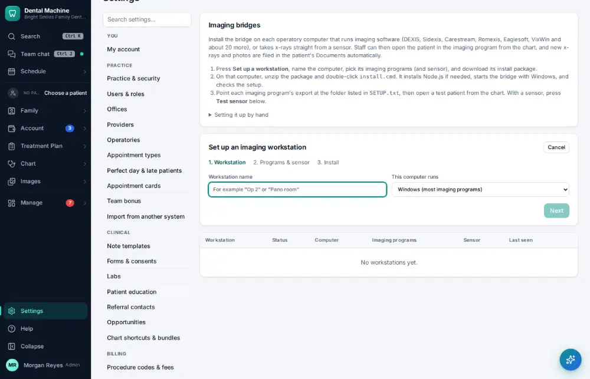
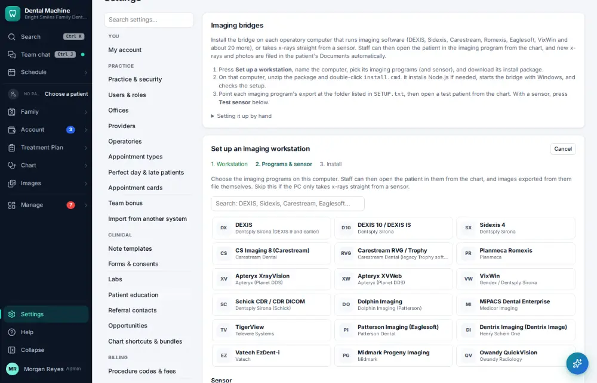
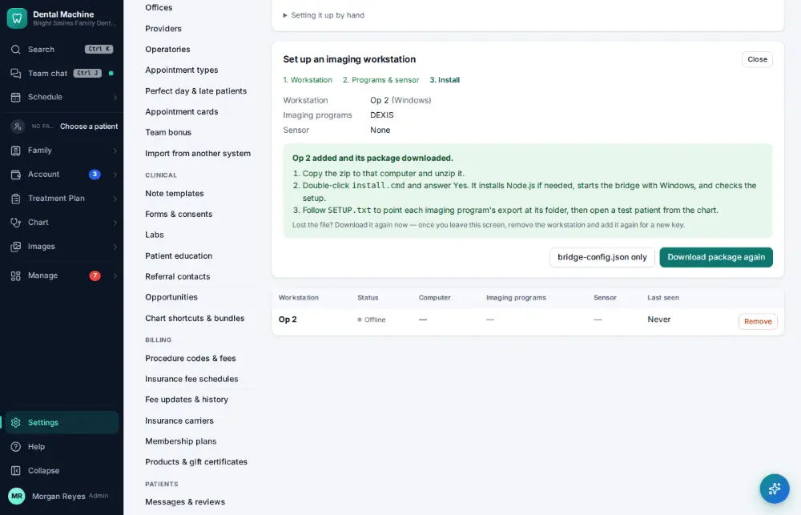

# How do I connect an imaging bridge or integration?

**Who:** office manager · **Where:** Settings → Imaging bridges (and Settings → Integrations) · **How often:** A few times a year

The imaging bridge connects a chair-side computer’s imaging programs and x-ray sensor to Dental Machine. An administrator sets up each workstation once.

## Steps

1. Click Settings (bottom of the menu), then "Imaging bridges": with no workstation yet, the setup is open

   

2. Type the workstation’s name ("Op 2") and press Enter  
   Keys: <kbd>Enter</kbd>

   

3. Click DEXIS, then "Add workstation and download": the install package (with its key) downloads

   

## Tips

- docs/imaging-bridges.md and docs/imaging-sensors.md have the full set-up and the first test.
- Other connections (card payments, texting, email, labs) are in Settings → Integrations; each call they make shows in Settings → Connection activity.

## Related

- [How do I take x-rays with the sensor?](A030-take-x-rays-with-the-sensor.md)
- [How do I import data from another system?](A183-import-data-from-another-system.md)
- [How do I set up an online booking link?](A180-set-up-an-online-booking-link.md)
- [How do I turn on two-step sign-in?](A181-turn-on-two-step-sign-in.md)
- [How do I add a provider?](A172-add-a-provider.md)

---
[All how-tos](README.md) · Action A182 · screenshots from the robot run of 2026-09-25
