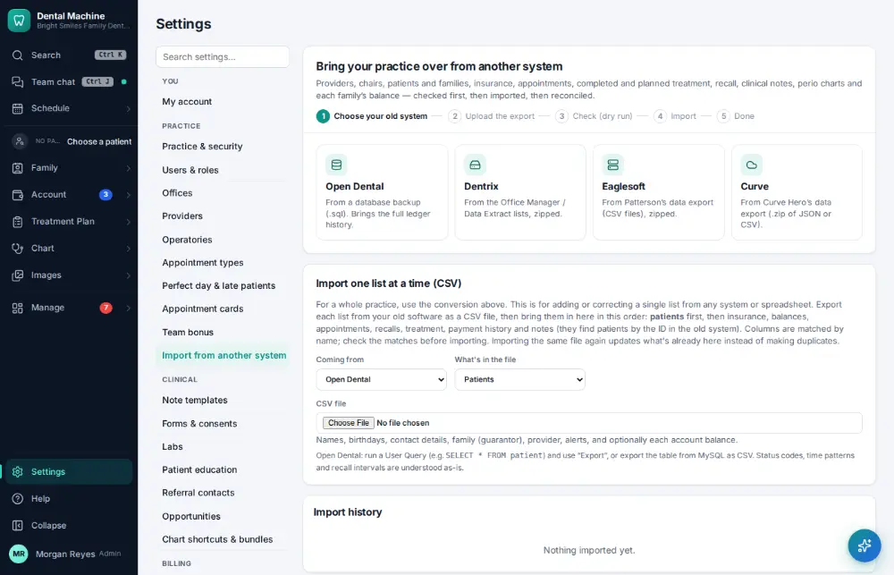
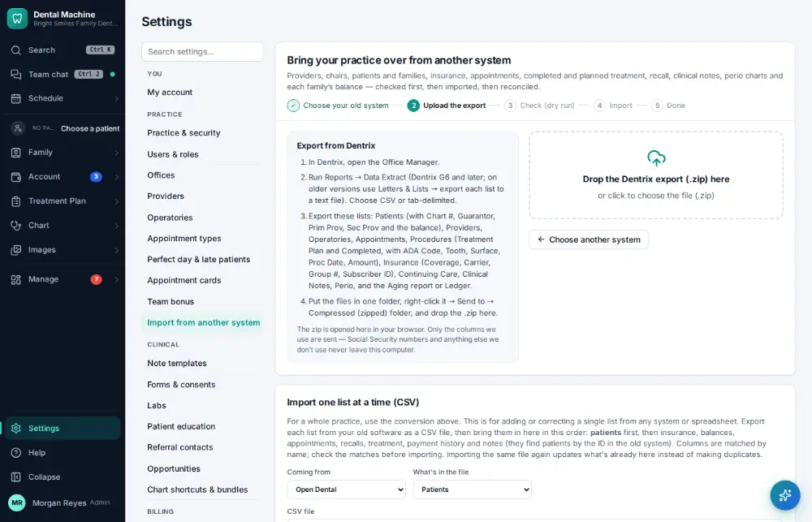
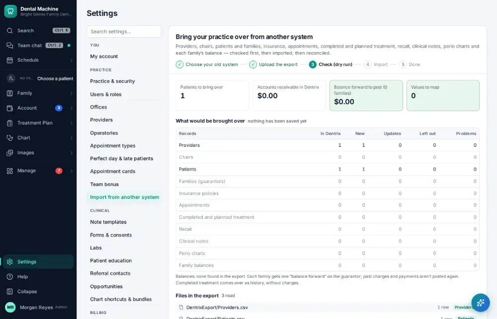
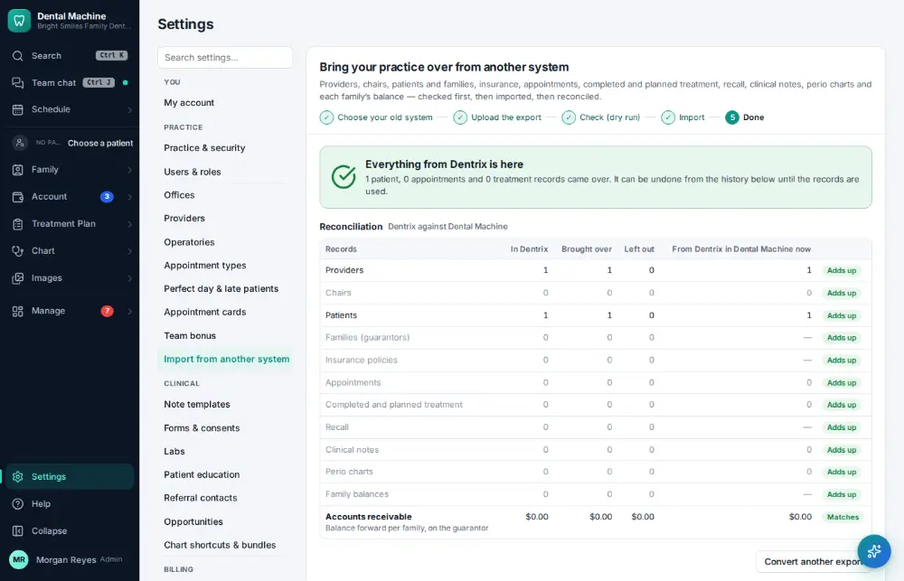

# How do I import data from another system?

**Who:** office manager · **Where:** Settings → Import from another system · **How often:** A few times a year

Bring patients, families, insurance, appointments, treatment, balances, notes and perio over from another system. A dry run shows what would come across before anything is saved, and the import is reconciled against the export.

## Steps

1. Click Settings (bottom of the menu), then "Import from another system"

   

2. Click "Dentrix": where to find the export in Dentrix, and a place to drop it

   

3. Click the drop area and choose the export: a dry run shows what would come over (nothing saved yet)

   

4. Click "Import from Dentrix": imported, then reconciled against the export

   

## Tips

- Nothing is final until you say so, and an import can be undone.

## Related

- [How do I connect an imaging bridge or integration?](A182-connect-an-imaging-bridge-or-integration.md)
- [How do I set up an online booking link?](A180-set-up-an-online-booking-link.md)
- [How do I turn on two-step sign-in?](A181-turn-on-two-step-sign-in.md)
- [How do I add a provider?](A172-add-a-provider.md)
- [How do I add an operatory?](A173-add-an-operatory.md)

---
[All how-tos](README.md) · Action A183 · screenshots from the robot run of 2026-09-25
