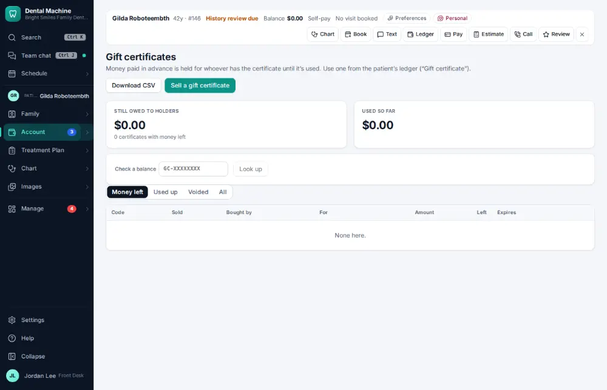
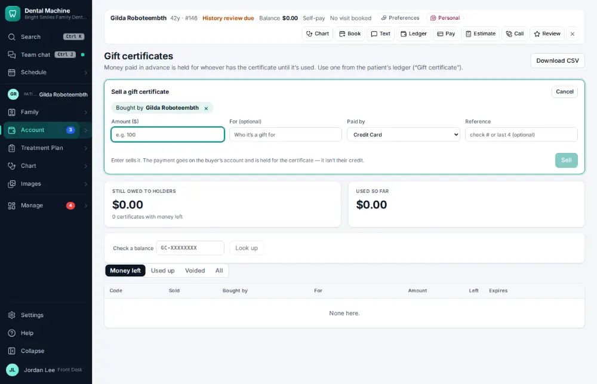
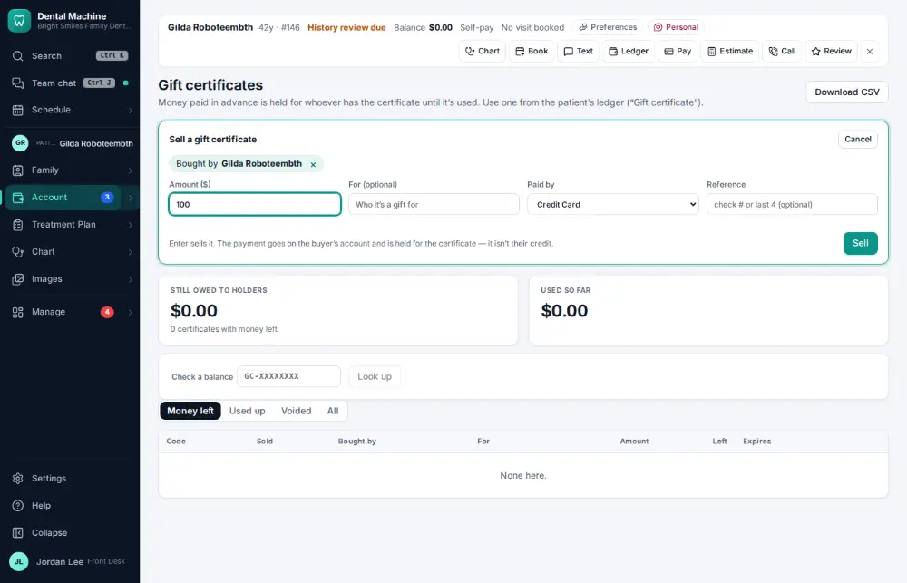
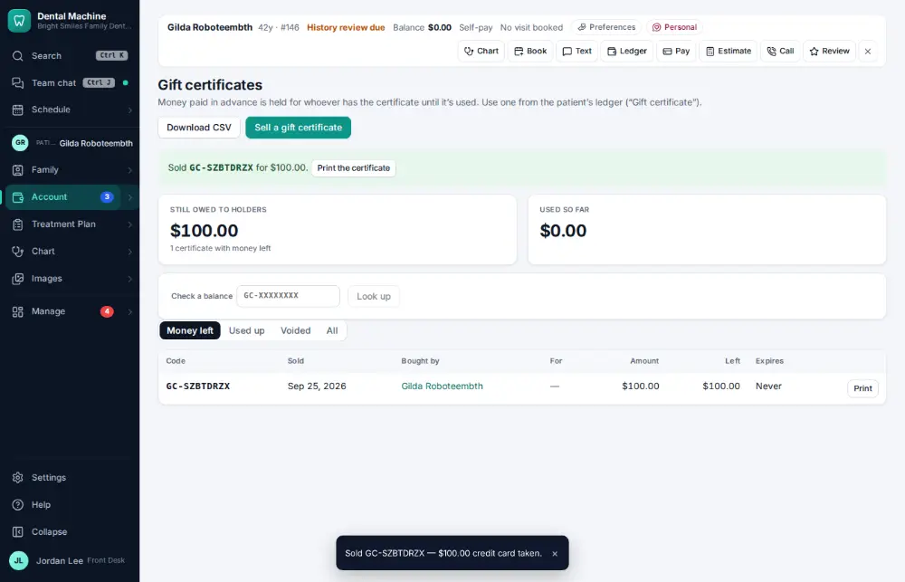

# How do I sell or redeem a gift certificate?

**Who:** front desk · **Where:** Account ▾ → Gift certificates · **How often:** A few times a year

N on Gift certificates sells one: the buyer is the active patient and it is paid the way you usually take payments. Type the amount and press Enter; the code is shown with “Print the certificate”.

## Where to start

## Steps

1. Account → Gift certificates: press N — the buyer is the active patient, paid the way this person usually takes payments  
   Keys: <kbd>N</kbd>

   

2. Type the amount

   

3. Press Enter: sold — the code is shown with "Print the certificate"  
   Keys: <kbd>Enter</kbd>

   

## Tips

- To use one, choose “Gift certificate” on the ledger (or “Use a gift certificate” in the command bar).

## Related

- [How do I sell a product?](A176-sell-a-product.md)
- [How do I take a patient payment?](A019-take-a-patient-payment.md)
- [How do I send an account to collections?](A147-send-an-account-to-collections.md)
- [How do I send patient statements?](A119-send-patient-statements.md)
- [How do I reconcile insurance payments with the bank?](A127-reconcile-insurance-payments-with-the-bank.md)

---
[All how-tos](README.md) · Action A184 · screenshots from the robot run of 2026-09-25
